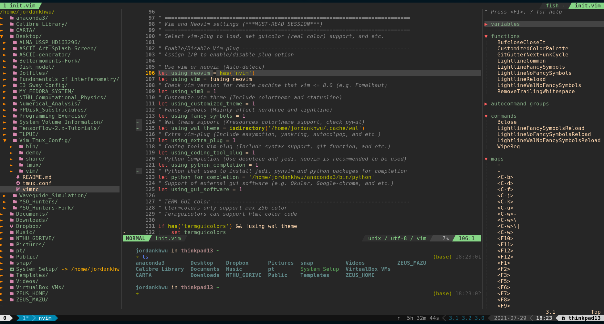
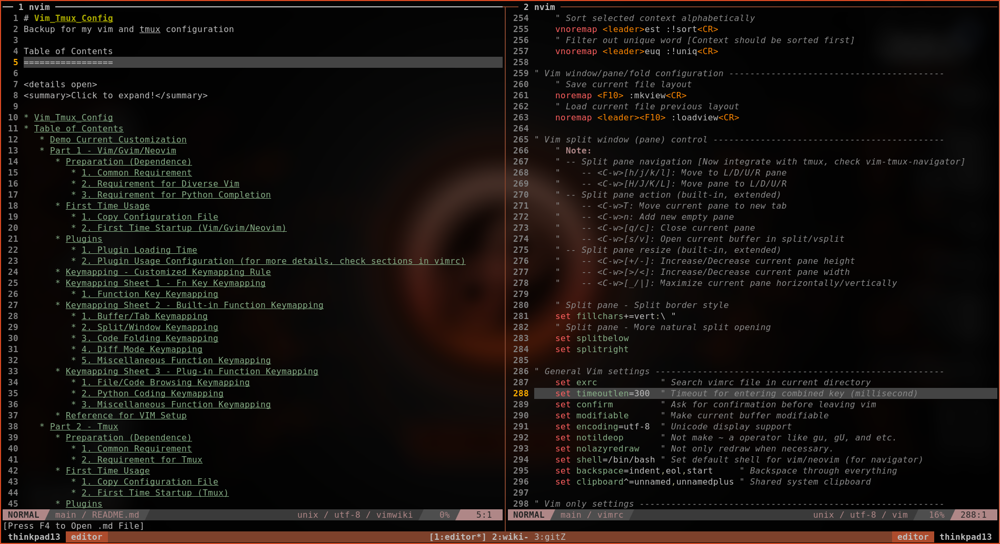
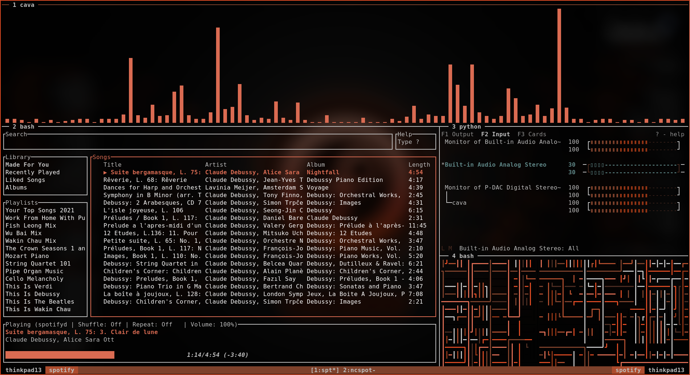

# Vim_Tmux_Config
Backup for my Vim and TMUX configuration

<details open>
<summary>Click to expand!</summary>

Table of Contents
=================
<details open>
<summary>Click to expand!</summary>

* [Vim_Tmux_Config](#vim_tmux_config)
* [Context](#context)
   * [Demo Current Customization](#demo-current-customization)
   * [Part 1 - Vim/Gvim/Neovim](#part-1---vimgvimneovim)
      * [Section 1 - What's New in My Customization (Vim)](#section-1---whats-new-in-my-customization-vim)
      * [Section 2 - First Time Usage (Vim)](#section-2---first-time-usage-vim)
         * [1. Preparation for Dependence (Vim)](#1-preparation-for-dependence-vim)
         * [2. Copy Configuration File (Vim)](#2-copy-configuration-file-vim)
         * [3. First Time Startup (Vim)](#3-first-time-startup-vim)
      * [Section 3 - Plugin Usage (Vim)](#section-3---plugin-usage-vim)
         * [1. Plugin Loading Time (Vim)](#1-plugin-loading-time-vim)
         * [2. Plugin Usage Configuration (Vim)](#2-plugin-usage-configuration-vim)
      * [Section 4 - Key Mapping (Vim)](#section-4---key-mapping-vim)
         * [Key Mapping - Customized Key Mapping Rule (Vim)](#key-mapping---customized-key-mapping-rule-vim)
         * [Key Mapping Sheet 1 - Fn Key Key Mapping (Vim)](#key-mapping-sheet-1---fn-key-key-mapping-vim)
         * [Key Mapping Sheet 2 - Built-in Function Key Mapping (Vim)](#key-mapping-sheet-2---built-in-function-key-mapping-vim)
         * [Key Mapping Sheet 3 - Plug-in Function Key Mapping (Vim)](#key-mapping-sheet-3---plug-in-function-key-mapping-vim)
         * [Key Mapping Sheet 4 - Vim Whichkey (Vim)](#key-mapping-sheet-4---vim-whichkey-vim)
      * [Reference for Setup (Vim)](#reference-for-setup-vim)
   * [Part 2 - TMUX](#part-2---tmux)
      * [Section 1 - What's New in My Customization (TMUX)](#section-1---whats-new-in-my-customization-tmux)
      * [Section 2 - First Time Usage (TMUX)](#section-2---first-time-usage-tmux)
         * [1. Preparation for Dependence (TMUX)](#1-preparation-for-dependence-tmux)
         * [2. Copy Configuration File (TMUX)](#2-copy-configuration-file-tmux)
         * [3. First Time Startup (TMUX)](#3-first-time-startup-tmux)
      * [Section 3 - Plugin Usage (TMUX)](#section-3---plugin-usage-tmux)
         * [Installed Plugins (TMUX)](#installed-plugins-tmux)
      * [Section 4 - Key Mapping (TMUX)](#section-4---key-mapping-tmux)
         * [Key Mapping - Customized Key Mapping Rule (TMUX)](#key-mapping---customized-key-mapping-rule-tmux)
         * [Key Mapping Sheet 1 - Session/Window/Pane Key Mapping (TMUX)](#key-mapping-sheet-1---sessionwindowpane-key-mapping-tmux)
         * [Key Mapping Sheet 2 - Copy-mode Key Mapping (TMUX)](#key-mapping-sheet-2---copy-mode-key-mapping-tmux)
         * [Key Mapping Sheet 3 - Plugin Key Mapping (TMUX)](#key-mapping-sheet-3---plugin-key-mapping-tmux)
         * [Key Mapping Sheet 4 - Miscellaneous (TMUX)](#key-mapping-sheet-4---miscellaneous-tmux)
      * [Reference for Setup (TMUX)](#reference-for-setup-tmux)

Created by [gh-md-toc](https://github.com/ekalinin/github-markdown-toc)

</details>

# Context
<details open>
<summary>Click to expand!</summary>

## Demo Current Customization
<details open>
<summary>Click to expand!</summary>

|                 | Color scheme                                                     | More Information                                                                           |
| :-------------: | :--------------------------------------------------------------: | :----------------------------------------------------------------------------------------: |
| Vim/Gvim/Neovim | [Gruvbox](https://github.com/morhetz/gruvbox)                    |                                                                                            |
| TMUX            | 8 pywal-color using [Pywal](https://github.com/dylanaraps/pywal) | For pywal usage, check [My_I3_Environment](https://github.com/JordanWu1997/I3_Sway_Config) |

<details open>
<summary>NEOVIM_DEMO_01</summary>



</details>

<details open>
<summary>NEOVIM_DEMO_02</summary>



</details>

<details open>
<summary>TMUX_DEMO_01</summary>



</details>
</details>

## Part 1 - Vim/Gvim/Neovim
<details open>
<summary>Click to expand!</summary>

### Section 1 - What's New in My Customization (Vim)
<details open>
<summary>Click to expand!</summary>

- [x] Use **_interchangeable configuration_** for various vim-family e.g vim, gvim, and neovim
- [x] Integrate **_useful vim-plugin_** e.g. auto-pair parentheses, auto-popup completion, and etc.
- [x] Integrate **_various color theme_** for better syntax highlighting e.g. gruvbox, nord, and etc.
- [x] Integrate **_Vim with TMUX_** for both pane/split and clipboard to work together smoothly
- [x] Map built-in/plugin-in function to keys that are easier to remember systematically
- [x] Add **_IDE-like features for python_** e.g. linter, formatter, analyzer, and etc.
- [x] Add **_IDE-like features using LSP_** e.g. linter, formatter, analyzer, and etc.
- [x] Add **_Markdown features_** e.g. preview, folding, wiki-style markdown writer, and etc.
- [x] Add **_Latex features_** e.g. real-time preview, compilation, and etc.
- [x] Try to minimize loading time while keeping maximal functionality/variety
- [x] Also offer Minimal **_cross-platform configuration_** (`./mini/mini.vim`) for both UNIX-like system and Windows system

</details>

### Section 2 - First Time Usage (Vim)
<details>
<summary>Click to expand!</summary>

#### 1. Preparation for Dependence (Vim)

1. Common Requirement
- __Git__ [for plugin installation]
    ```bash
    #\ For Fedora
    dnf install git
    ```
- __Curl__ [for plugin manager setup]
    ```bash
    #\ For Fedora
    dnf install curl
    ```

2. Requirement for Diverse Vim
- __Vim__
    - version >= __7.0__
    - clipboard option is on (+clipboard) [for sharing system clipboard]
    - python3 option is on (+python3/dyn) [for python completion]
    ```bash
    #\ Check vim version and other options
    vim --version
    ```
- __Gvim__
    - version >= __7.0__
    - gvim already shipped with clipboard and python3 options
    ```bash
    #\ Check gvim version and other options
    vim --version
    ```
- __Neovim__
    - version >= __0.4__
    - neovim already shipped with clipboard and python3 options
    ```bash
    #\ Check nvim version and other options
    nvim --version
    ```
3. Requirement for Python Completion
- __ipython__ (version >= __7.20__) [python consoler]
    ```bash
    #\ Python3
    pip install ipython
    ```
- __jedi__ for jedi [python code analyzer]
    ```bash
    #\ Python3
    pip install jedi
    ```
- __pynvim__ for deoplete neovim plugin usage [python code analyzer]
    ```bash
    #\ Python3
    pip install pynvim
    ```

4. Requirements for Basic Latex Compilation
- __texlive__ [latex suite]
    ```bash
    #\ For Fedora
    dnf install texlive-scheme-basic
    ```

5. Requirements for Latex/Markdown Viewer
- __Web browser with markdown extension__ (e.g. google-chrome, Firefox, and etc.) [for markdown preview]
    ```bash
    #\ For Fedora
    dnf install firefox
    ```
- __PDF viewer__ (e.g. zathura, Okular) [for latex preview]
    ```bash
    #\ For Fedora
    dnf install zathura*
    ```

#### 2. Copy Configuration File (Vim)
- __Vim/Gvim__
    1. copy `vimrc` to `$HOME` (current user's home)
    2. rename `vimrc` to `.vimrc`
    ```bash
    cp vimrc $HOME/.vimrc
    ```
- __Neovim__
    1. copy `vimrc` to `$HOME/.config/nvim` (create one if not exists)
    2. rename `vimrc` to `init.vim`
    ```bash
    mkdir -p $HOME/.config/nvim
    cp vimrc $HOME/.config/nvim/init.vim
    ```

#### 3. First Time Startup (Vim)
- Following installation should start automatically at the first time startup
    1. vim-plug (plug manager) installation via __curl__
        - If not working, try manually install vim-plug (also within this repository)
            ```bash
            #For vim/gvim
            cp -r vim/autoload $HOME/.vim
            #For neovim
            cp -r vim/autoload $HOME/.config/nvim
            ```
    2. vim plugin installation via __vim-plug__
        - If not working, try manually install vim-Plug
            ```bash
            #In vim command line mode
            :Pluginstall
            ```

</details>

### Section 3 - Plugin Usage (Vim)
<details>
<summary>Click to expand!</summary>

#### 1. Plugin Loading Time (Vim)
- Enable too much plugins may slow down your vim. You can check your loading time with following command
- For managing plugins enable/disable, see next section (Plugin usage configuration)
```bash
#For vim/gvim
vim --startuptime /tmp/startup.log FILE_TO_TEST +q && vim /tmp/startup.log
#For neovim
vim --startuptime /tmp/startup.log FILE_TO_TEST +q && vim /tmp/startup.log
```

#### 2. Plugin Usage Configuration (Vim)
for more details, check sections in vimrc

- Plugin usage can be configured in the first section of vimrc
    ```vim
    " ============================================================================
    " Vim and Neovim settings
    " ============================================================================
    " Select vim-plug to load, set GUI color (real color) support, and etc.
    " Assign 0 to disable plug option
    ```
- Detect using neovim or not (automatic detection)
    - Neovim is better for loading tons of plugins
    - Neovim configuration path is different from vim
    - If using vim, `vim-hug-neovim-rpc` plug will be loaded to bridge vim and neovim
    ```vim
    " Use vim or neovim (Auto-detect)
    let USING_NEOVIM = has('nvim')
    let USING_VIM = !USING_NEOVIM
    ```
- Check if using vim 8.0 or higher
    - If vim version is less than 8.0, some function is not available (e.g. terminal)
    - Required for
        - [Built-in] terminal mode
        - [Plug-in] vim-polyglot (multi-language support)
        - [Plug-in] ale (multi-languages syntax highlight)
    ```vim
    " Check if vim version >= 8.0 (also for neovim >= 0.5)
    let USING_VIM8 = 1
    ```
- Customize vim color scheme
    - For fancy symbol support, nerd font is needed (check https://github.com/ryanoasis/nerd-fonts )
    - For pywal theme support, pywal is needed (check https://github.com/dylanaraps/pywal ),
      also remember to change the directory path to your $HOME/.cache/wal
    ```vim
    " Customize vim theme (Include colorscheme and statusline)
    let USING_CUSTOMIZED_THEME = 1
    " Fancy symbols (Mainly affect lightline and nerdtree icon)
    let USING_FANCY_SYMBOLS = 1
    " Wal theme support (Xresources colortheme support, check pywal)
    "let USING_WAL_THEME = isdirectory('/home/jordankhwu/.cache/wal')
    let USING_WAL_THEME = 0
    ```
- Extra vim-plug
    - Extra plug for productivity (or enhance vim-built in function)
    - Including
        - [Plug-in] goyo (distraction-free editor)
        - [Plug-in] limelight (light-off with goyo)
        - [Plug-in] vim-startify (start page for empty buffer)
        - [Plug-in] vimwiki (markdown wiki in vim)
        - [Plug-in] yankring (clipboard history)
        - [Plug-in] vim-peekaboo (vim register viewer/manager)
        - [Plug-in] vim-markbar (vim mark viewer/manager)
        - [Plug-in] vim-easymotion (physical movement)
        - [Plug-in] AutoComplPop (auto completion pop-up)
        - [Plug-in] FixedTaskList (find TODO tag in vim)
        - [Plug-in] vim-hexokinase (hex color code color highlight support)
    ```vim
    " Extra vim-plug (Include easymotion, yankring, autocolpop, and etc.)
    let USING_EXTRA_PLUG = 1
    ```
- Coding tool vim-plug
    - Tools for coding, git, language syntax highlight
    - Including
        - [Plug-in] vim-polyglot (multi-language support)
        - [Plug-in] ale (multi-language syntax highlight)
        - [Plug-in] neoformat (code formatter)
        - [Plug-in] rainbow (pair bracket highlight)
        - [Plug-in] indentLine (indent line indicator)
        - [Plug-in] vim-indent-guides (indent highlight)
        - [Plug-in] vim-indent-object (add indent object to vim)
        - [Plug-in] vim-visual-multi (multiple cursors)
        - [Plug-in] vim-fugitive (git toolbox)
        - [Plug-in] vim-gitgutter (git diff highlight)
    ```vim
    " Coding tools vim-plug (Include syntax support, git function, and etc.)
    let USING_CODING_TOOL_PLUG = 1
    ```
- Python completion vim-plug
    - Tools for python completion
    - Requirements must be satisfied (check python completion preparation at the first session)
    - Including
        - [Plug-in] nvim-yarp (yet another remote plugin framework for neovim)
        - [Plug-in] vim-hug-neovim-rpc (plugin bridge from neovim to vim)
        - [Plug-in] deoplete-jedi (python completion)
        - [Plug-in] jedi-vim (definition and feature finder)
    ```vim
    " Python Completion (Use deoplete and jedi, neovim is recommended to be used)
    let USING_PYTHON_COMPLETION = 1
    " Python that used to install jedi, pynvim and python packages for completion
    let PYTHON_FOR_COMPLETION = '/usr/bin/python'
    ```
- Python skeleton file
    - Add preset python skeleton file for new created `.py` python file
    - If you use different skeleton file, please change `s:PYTHON_SKELETON` variable
    ```vim
    " Add python skeleton file for new created .py python file
    let USING_PYTHON_SKELETON = 1
    " Python Skeleton file
    let s:PYTHON_SKELETON = '$HOME/Desktop/Vim_Tmux_Config/share/skeleton.py'
    ```
- GUI support
    - Functions for external GUI software
    - Requires
        - Latex previewer
        - Markdown previewer
    ```vim
    " Support of external GUI software (e.g. Okular, Google-chrome, and etc.)
    let USING_GUI_SOFTWARE = 1
    " Web browser for markdown preview
    let WEBBROWSER = 'brave-browser'
    ```

</details>

### Section 4 - Key Mapping (Vim)
<details>
<summary>Click to expand!</summary>

#### Key Mapping - Customized Key Mapping Rule (Vim)
<details open>
<summary>Click to expand!</summary>

> _1. Key Mapping should not be much different from the original VIM_
- To make life easier instead of filled up with bloated key mapping
> _2. Every function (motion) should start with a leader key for most of time_
- To prevent conflict with built-in hotkey or other program hotkeys
- In this configuration, leader key is __SPACE__ key
> 3. _Key mapping should be related to the name of the function_
- Make it easier to remember or connect with configuration
- e.g. "wrap toggle" function is mapped to `[Space]`+`[w]`+`[p]`

</details>

#### Key Mapping Sheet 1 - Fn Key Key Mapping (Vim)
<details>
<summary>Click to expand!</summary>

1. Function Key Key Mapping

| VIM-Mode | Key Mapping      | Function                        | Description                      | Note                                              |
| :------: | :--------------: | :-----------------------------: | :------------------------------: | :-----------------------------------------------: |
| N/V      | `[F1]`           | Vim help page                   | Vim help page (help.txt)         | Built-in function                                 |
| N/V      | `[F3]`           | Toggle NerdTree                 | On/Off NerdTree plugin           |                                                   |
| N/V      | `[LK]`+`[F3]`    | NerdTree current file           | Show current file location       |                                                   |
| N/V      | `[F4]`           | Toggle Tagbar                   | On/Off Tagbar plugin             |                                                   |
| N/V      | `[LK]`+`[F4]`    | Markdown/Latex previewer        | Open external Viewer             | Only for .md or .tex file                         |
| N/V      | (`[LK]`)+`[F5]`  | Toggle (Rel)/Abs line number    | On/Off rel/abs line number       |                                                   |
| N/V      | `[F6]`           | Toggle fold column (short-4)    | On/Off fold column (short-4)     | For easier code fold visualization                |
| N/V      | `[LK]`+`[F6]`    | Toggle fold column (long-8)     | On/Off fold column (long-8)      | For easier code fold visualization                |
| N/V      | `[F7]`           | Toggle show line border         | On/Off highlight 79th character  | VIM recommends at most 78 characters for one line |
| N/V      | `[LK]`+`[F7]`    | Toggle show line border         | On/Off highlight 79th column     | VIM recommends at most 78 characters for one line |
| N/V      | `[F8]`           | Toggle highlight comment        | On/Off highlight code comment    | Assign brighter color to comment to highlight it  |
| N/V      | `[LK]`+`[F8]`    | Toggle highlight fold           | On/Off highlight  vim fold       | Assign brighter color to comment to highlight it  |
| N/V      | `[F9]`           | Toggle indent highlight (line)  | On/Off indent highlight (line)   |                                                   |
| N/V      | `[LK]`+`[F9]`    | Toggle indent highlight (block) | On/Off indent highlight (block)  |                                                   |
| N/V      | (`[LK]`)+`[F10]` | (Load)/Save vim layout          | Load/Save vim layout             | Including pane split, folds, and etc.             |
| N/V      | (`[LK]`)+`[F11]` | (Off)/On synchronized cursor    | Off/On synchronized cursor       | Need to execute in every panes to synchronize     |
| N/V      | (`[LK]`)+`[F12]` | (Exit)/Enter terminal mode      | Exit/Enter terminal mode         |                                                   |

</details>

#### Key Mapping Sheet 2 - Built-in Function Key Mapping (Vim)
<details>
<summary>Click to expand!</summary>

1. Arg/Buffer/Tab Key Mapping

| VIM-Mode | Key Mapping                    | Function                        | Description                | Note                                               |
| :------: | :----------------------------: | :-----------------------------: | :------------------------: | :------------------------------------------------: |
| N/V      | `[LK]`+`[b]`+`[a/d/e]`         | Add/Delete/Edit new buffer      | Add/Delete/Edit new buffer | Here b for (b)uffer. Edit action will switch focus |
| N/V      | `[LK]`+`[b]`+`[n/p]`           | Go to next/prev buffer          | Go to next/prev buffer     |                                                    |
| N/V      | `[LK]`+`[a]`+`[a/d/e]`         | Add/Delete/Edit current to args | Add/Delete current to args | Here a for (a)rg. Edit action will switch focus    |
| N/V      | `[LK]`+`[a]`+`[n/p]`           | Go to next/prev arg             | Go to next/prev arg        |                                                    |
| N/V      | `[LK]`+`[t]`+`[a/d/e]`         | Add/Delete/Edit new tab         | Add/Delete new tab         | Here f for (t)ab. Edit action will switch focus    |
| N/V      | `[LK]`+`[t]`+`[n/p]`           | Go to next/prev tab             | Go to next/prev tab        |                                                    |
| N/V      | `[LK]`+`[t]`+`[Shift]`+`[n/p]` | Move tab to next/prev tab       | Move tab to next/prev tab  |                                                    |

2. Split/Window Key Mapping

| VIM-Mode | Key Mapping                          | Function                          | Description                        | Note                                                        |
| :------: | :----------------------------------: | :-------------------------------: | :--------------------------------: | :---------------------------------------------------------: |
| N/V      | `[Ctrl]`+`[w]`+`[s/v]`               | Add new split Horizontal/Vertical | Add new split Horizontal/Vertical  |                                                             |
| N/V      | `[Ctrl]`+`[h/j/k/l]`                 | Move between vim splits           | Move between splits (L/D/U/R)      | With plugin, you can move between TMUX panes and VIM splits |
| N/V      | `[Ctrl]`+`[w]`+`[h/j/k/l]`           | Move between vim splits           | Move between splits (L/D/U/R)      |                                                             |
| N/V      | `[Ctrl]`+`[w]`+`[Shift]`+`[h/j/k/l]` | Move current split (L/D/U/R)      | Move current split (L/D/U/R)       |                                                             |
| N/V      | `[Ctrl]`+`[w]`+`[Shift]`+`[t]`       | Move current split to new tab     | Move current split to new tab      |                                                             |
| N/V      | `[Alt]`+`[h/j/k/l]`                  | Resize current split size         | Resize current split size          |                                                             |
| N/V      | `[Ctrl]`+`[w]`+`[=]`                 | Re-split splits equally           | Re-split splits equally            | Here =(equal sign) for equally split                        |
| N/V      | `[LK]`+`[r]`+`[1/2]`                 | Resize current split to 10/20rows | Resize current split to 10/20 rows | For VIM terminal pane resize                                |

3. Code Folding Key Mapping

| VIM-Mode | Key Mapping             | Function                     | Description                              | Note         |
| :------: | :---------------------: | :--------------------------: | :--------------------------------------: | :----------: |
| N/V      | (`[LK]`)+`[F10]`        | Load/Save layout and folding | Load/Save current split and code folding |              |
| N/V      | `[z]`+`[k/j]`           | Go to Prev/Next folding      | Go to Prev/Next folding                  | Vim built-in |
| N/V      | `[z]`+`[o/c]`           | Open/Close current folding   | Open/Close current folding               | Vim built-in |
| N/V      | `[z]`+`[Shift]`+`[r/m]` | Show/Close all foldings      | Show/Close all foldings                  | Vim built-in |
| V        | `[Shift]`+`[k/j]`       | Move selection block up/down | Move selection block up/down             |              |

4. Diff Mode Key Mapping

| VIM-Mode | Key Mapping          | Function                           | Description                        | Note                                        |
| :------: | :------------------: | :--------------------------------: | :--------------------------------: | :-----------------------------------------: |
| N/V      | `[LK]`+`[d]`+`[s/v]` | Add diff split Horizontal/Vertical | Add diff split Horizontal/Vertical |                                             |
| N/V      | `[Lk]`+`[d]`+`[j/k]` | Jump to next/prev diff             | Jump to next/prev diff             |                                             |
| N/V      | `[Lk]`+`[d]`+`[g]`   | Get diff from neighbor pane        | Get diff from neighbor pane        | Recommend to use with visual mode selection |
| N/V      | `[Lk]`+`[d]`+`[p]`   | Put diff to neighbor pane          | Put diff to neighbor pane          | Recommend to use with visual mode selection |
| N/V      | `[Lk]`+`[d]`+`[u]`   | Update diff                        | Update diff                        |                                             |

5. Spell Mode Key Mapping

| VIM-Mode | Key Mapping              | Function                                   | Description                                | Note                              |
| :------: | :----------------------: | :----------------------------------------: | :----------------------------------------: | :-------------------------------: |
| N/V      | `[LK]`+`[s]`+`[l]`       | Toggle spell mode                          | Toggle spell mode                          | Here sl for (s)pel(l)             |
| N/V      | `[LK]`+`[s]`+`[j/k]`     | Jump to next/prev bad word                 | Jump to prev/next bad word                 |                                   |
| N/V      | `[LK]`+`[s]`+`[a]`+`[g]` | Add word to good word list spell mode      | Add word to good word list spell mode      | Here a for (a)dd, g for (g)ood    |
| N/V      | `[LK]`+`[s]`+`[r]`+`[g]` | Remove word from good word list spell mode | Remove word from good word list spell mode | Here r for (r)emove, g for (g)ood |
| N/V      | `[LK]`+`[s]`+`[a]`+`[b]` | Add word to bad word list spell mode       | Add word to bad word list spell mode       | Here a for (a)dd, b for (b)ad     |
| N/V      | `[LK]`+`[s]`+`[r]`+`[b]` | Remove word from bad word list spell mode  | Remove word from bad word list spell mode  | Here r for (r)emove, b for (b)ad  |

6. Quickfix/Location List Key Mapping

| VIM-Mode | Key Mapping              | Function                                | Description                                 | Note                                 |
| :------: | :----------------------: | :-------------------------------------: | :-----------------------------------------: | :----------------------------------: |
| N        | `[LK]`+`[q/e]`+`[g]`     | call built-in vimgrep/lvimgrep function | search like grep and store results in lists |                                      |
| N        | `[LK]`+`[q/e]`+`[o]`     | toggle quickfix/location list pane      | toggle quickfix/location list pane          | built-in: copen/cclose, lopen/lclose |
| N        | `[LK]`+`[q/e]`+`[j/k]`   | go to next/prev quickfix/location item  | go to next/prev quickfix/location item      | built-in: cnext/cprev, lnext/lprev   |
| N        | `[LK]`+`[q]`+`[d]`       | call cdo for items in quickfix list     | call cdo for items in quickfix list         | like argdo, bdo for args and buffers |

7. Miscellaneous Function Key Mapping

| VIM-Mode | Key Mapping          | Function                          | Description                       | Note                                       |
| :------: | :------------------: | :-------------------------------: | :-------------------------------: | :----------------------------------------: |
| I        | `[k]`+`[j]`          | Esc (escape form insert mode)     | Esc (escape form insert mode)     |                                            |
| N/V      | `[Shift]`+`[k]`      | Search current word in manual     | Search current word in manual     |                                            |
| N/V      | `[Alt]`+`[/]`        | Toggle search highlight           | On/Off search highlight           |                                            |
| N/V      | `[LK]`+`[w]`+`[p]`   | Toggle line wrap                  | On/Off line wrap                  | Here wp for (w)ra(p)                       |
| N/V      | `[LK]`+`[c]`+`[l]`   | Toggle list characters show-up    | On/Off list characters show-up    | Here cl for (c)haracter (l)ist             |
| N/V      | `[LK]`+`[m]`+`[k]`   | Show all vim marks                | Show all vim marks                | Here mk for (m)ar(k)                       |
| N/V      | `[LK]`+`[r]`+`[r]`   | Show all vim registers            | Show all vim registers            | Here re for (r)egiste(r)                   |
| N/V      | `[LK]`+`[a]`+`[b]`   | Show all vim abbreviates          | Show all vim abbreviates          | Here ab for (a)(b)breviate                 |
| N/V      | `[LK]`+`[c]`+`[h/v]` | Toggle Horizontal/Vertical cursor | On/Off Horizontal/Vertical cursor |                                            |
| N/V      | `[LK]`+`[g]`+`[o/i]` | Show all cursor jump              | Show all cursor jump              | `[g/Ctrl]`+`[o/i]` jump backwards/forwards |
| N/V      | `[LK]`+`[g]`+`[;/,]` | Show all file change              | Show all file change              | `[g]`+`[;/,]` go to earlier/later change   |

</details>

#### Key Mapping Sheet 3 - Plug-in Function Key Mapping (Vim)
<details>
<summary>Click to expand!</summary>

1. File/Code Browsing Key Mapping
- Note: Fzf is needed for file browsing

| VIM-Mode | Key Mapping                     | Function                              | Description                           | Note                                    |
| :------: | :-----------------------------: | :-----------------------------------: | :-----------------------------------: | :-------------------------------------: |
| N/V      | `[F3]`                          | Nerdtree Current Files                | Show current file location            |                                         |
| N/V      | `[LK]`+`[F3]`                   | Toggle Nerdtree                       | On/Off NerdTree plugin                |                                         |
| N        | `[s/v]`                         | Open file in split/vsplit pane        | Open file in split/vsplit pane        | In NERDTree pane                        |
| N        | (`[Shift]`)+`[t]`               | Open file in new tab (silently)       | Open file in new tab (silently)       | In NERDTree pane                        |
| N        | `[g]`+`[s/v]`                   | Preview file in split/vsplit pane     | Preview file in split/vsplit pane     | In NERDTree pane                        |
| N        | `[c]`+`[d]`                     | Change pwd to selected location       | Change pwd to selected location       | In NERDTree pane                        |
| N        | `[Shift]`+`[c]`+`[Shift]`+`[d]` | Change tree root to selected location | Change tree root to selected location | In NERDTree pane                        |
| N        | (`[Shift]`)+`[o/x]`             | Open/Close folds (recursively)        | Open/Close folds (recursively)        | In NERDTree pane                        |
| N/V      | `[LK]`+`[u]`+`[t]`              | Toggle Undotree                       | On/Off Undotree (visualizer) plugin   | Vim built-in undotree visualizer        |
| N/V      | `[LK]`+`[F4]`                   | Toggle Tagbar                         | On/Off Tagbar plugin                  |                                         |
| N        | `[p]`                           | Preview tags within Tagbar            | Preview tags within Tagbar            | In Tagbar pane                          |
| N        | `[d]`                           | Show definition of tags               | Show definition of tags               | In Tagbar pane                          |
| N        | `[o]``                          | Toggle folds                          | Toggle folds                          | In Tagbar pane                          |
| N        | `[LK]`+`[f]`+`[f]`+`[s]`        | List files under input directory      | List files under input directory      |                                         |
| N        | `[LK]`+`[f]`+`[l]`+`[c]`        | Locate files matched input            | Locate files matched input name       | Use system locate command               |
| N        | `[LK]`+`[f]`+`[r]`+`[g]`        | Find files with input pattern         | Find files matched input pattern      | Use system ripgrep command              |
| N        | `[LK]`+`[f]`+`[f]`+`[t]`        | Select file type for current file     | Select file type for current file     |                                         |
| N        | `[LK]`+`[f]`+`[c]`+`[d]`        | Show all command in vim now　         | Show all command in vim now           | 　                                      |
| N        | `[LK]`+`[f]`+`[n]`+`[m]`        | Show all normal mode mapping          | Show all normal mode mapping          |                                         |
| N        | `[LK]`+`[f]`+`[h]`+`[t]`        | Show all helptags in vim-help         | Show all helptags in vim-help         |                                         |
| N        | `[LK]`+`[f]`+`[q]`+`[f]`        | Show build-in quickfix list           | Show build-in quickfix list           | vim quickfix list                       |
| N        | `[LK]`+`[f]`+`[l]`+`[l]`        | Show build-in location list           | Show build-in location list           | vim location list                       |
| N        | `[LK]`+`[f]`+`[c]`+`[l]`        | Show build-in change list             | Show build-in change list             | `./vim/patch/fzf_patch.vim` is required |
| N        | `[LK]`+`[f]`+`[j]`+`[l]`        | Show build-in jump list               | Show build-in jump list               | `./vim/patch/fzf_patch.vim` is required |

2. Python Coding Key Mapping
- Note: Jedi is needed for python code analysis (Check https://github.com/davidhalter/jedi )
- Note: All below functions only work in .py files

| VIM-Mode | Key Mapping                  | Function                      | Description                       | Note                            |
| :------: | :--------------------------: | :---------------------------: | :-------------------------------: | :-----------------------------: |
| N/V      | `[Shift]`+`[k]`              | Search current word in doc    | Search current word in python doc |                                 |
| N/V      | `[LK]`+`[p]`+`[n]`           | Find current word occurrences | Find current word occurrences     | Here p for (p)ython             |
| N/V      | `[LK]`+`[p]`+`[a]`           | Find current word assignment  | Find current word assignment      |                                 |
| N/V      | `[LK]`+`[p]`+`[d]`           | Show current word definition  | Show current word definition      |                                 |
| N/V      | `[LK]`+`[p]`+`[m]`           | Show current word init.py     | Show current word init.py         |                                 |
| N/V      | `[LK]`+`[p]`+`[Shift]`+`[m]` | Show input module init.py     | Show input module init.py         |                                 |
| N        | `[LK]`+`[p]`+`[i]`           | Run import module formatter   | Run isort formatter (for modules) | isort needs to be installed     |
| N        | `[LK]`+`[p]`+`[y]`           | Run code formatter            | Run yapf formatter (for formats)  | pyment needs to be installed    |
| N/V      | `[LK]`+`[p]`+`[t]`+`[d]`     | Run pyment (default: reST)    | Run pyment (default: reST)        | pyment needs to be installed    |
| N/V      | `[LK]`+`[p]`+`[t]`+`[g]`     | Run pyment (google)           | Run pyment (google style)         | pyment needs to be installed    |
| N/V      | `[LK]`+`[p]`+`[t]`+`[j]`     | Run pyment (javadoc)          | Run pyment (javadoc style)        | pyment needs to be installed    |
| N/V      | `[LK]`+`[p]`+`[t]`+`[n]`     | Run pyment (numpydoc)         | Run pyment (numpydoc style)       | pyment needs to be installed    |
| N/V      | `[LK]`+`[p]`+`[b]`           | Insert pdb trace start        | Insert pdb trace start            | pdb is python built-in debugger |
| N/V      | `[LK]`+`[p]`+`[Shift]`+`[b]` | Run pdb in new terminal pane  | Run pdb in new terminal pane      | pdb is python built-in debugger |

3. Miscellaneous Function Key Mapping
- Useful tool (Note: startup by default)

| VIM-Mode | Key Mapping                        | Function                        | Description                           | Note                      |
| :------: | :--------------------------------: | :-----------------------------: | :-----------------------------------: | :-----------------------: |
| N/V      | `[LK]`+`[c]`+`[c/y]`               | Comment (and copy) current line | Comment (and copy) current line       | NerdCommenter             |
| N/V      | `[LK]`+`[c]`+`[u]`                 | Uncomment current line          | Uncomment current line                | NerdCommenter             |
| N/V      | `[LK]`+`[Shift]`+`["]`             | Select vim pane                 | Select vim pane in tabs and splits    | vim-choosewin             |
| N/V      | `[LK]`+`[z]`                       | Toggle maximize current split   | On/Off maximize current split         | vim-maximizer             |
| N/V      | `[Ctrl]`+`[w]`+`[z]`               | Toggle maximize current split   | On/Off maximize current split         | vim-maximizer             |
| N/V      | `[y]`+`[s]`+`[a]`+`[w]`+`["]`      | Add wrapped quotation/bracket   | From word to "word"                   | vim-surrounder            |
| N/V      | `[d]`+`[s]`+`[a]`+`[w]`+`["]`      | Del wrapped quotation/bracket   | From "word" to word                   | vim-surrounder            |
| N/V      | `[c]`+`[s]`+`[']`+`["]`            | Change quotation/bracket        | From 'word' to "word"                 | vim-surrounder            |
| N/V/I    | `[LK]`+`[`]`                       | Toggle auto-completion pop-up   | On/Off auto-completion pop-up         | autocomplpop              |
| N/V/I    | `[Alt]`+`[']`                      | Toggle auto-pair                | On/Off auto-pair quotation/bracket    | auto-pairs                |
| N/V/I    | `[Alt]`+`[;]`                      | Jump to next pairs              | Jump to next paired quotation/bracket | auto-pairs                |
| I        | `[Alt]`+`[w]`                      | Auto-pair fastwrap              | Auto-pair fastwrap current pairs      | Example: ()test -> (test) |
| N/V      | `[LK]`+`[c]`+`[w]`                 | Highlight current word          | Highlight current word and its twins  | vim-current-word          |
| N        | `[LK]`+`[w]`+`[Shift]`+`[i]`       | Open vimwiki index page         | Open vimwiki index page               | vimwiki                   |
| N        | `[LK]`+`[w]`+`[d]`+`[Shift]`+`[i]` | Open vimwiki diary index page   | Open vimwiki diary index page         | vimwiki                   |

- Extra plug (Note: "let using_extra_plug = 1" must be set in vimrc)

| VIM-Mode | Key Mapping        | Function                     | Description                  | Note           |
| :------: | :----------------: | :--------------------------: | :--------------------------: | :------------: |
| N        | `[LK]`+`[h/j/k/l]` | Quick move in four direction | Quick move in four direction | vim-easymotion |
| N        | `[LK]`+`[/]`       | Search and then move         | Search and then move         | vim-easymotion |
| N/V      | `[LK]`+`[y]`+`[s]` | Show yank history            | Show yank history            | yankring       |
| N/V      | `[y]`+`[n/p]`      | Paste next/prev clipped item | Paste next/prev clipped item | yankring       |
| N/V      | `[LK]`+`[g]`+`[y]` | Distraction-free mode        | Distraction-free mode        | goyo           |

- Coding tool (Note: "let using_coding_tool_plug = 1" must be set in vimrc)

| VIM-Mode | Key Mapping                           | Function                        | Description                                        | Note                                                          |
| :------: | :-----------------------------------: | :-----------------------------: | :------------------------------------------------: | :-----------------------------------------------------------: |
| N        | `[Alt]`+`[n]`                         | Enter visual-multi mode         | Enter visual-multi mode with selected word         | Press n to next word; q to ignore word, Q to erase word mark  |
| N        | `[Alt]`+`[a]`                         | Enter visual-multi mode         | Enter visual-multi mode with all selected word     | Press n to next word; q to ignore word, Q to erase word mark  |
| N        | `[Alt]`+`[Shift]`+`[j/k]`             | Add vertical multi-cursor       | Enter visual-multi mode and add vertical cursor    |                                                               |
| N/V      | `[LK]`+`[e]`+`[l]`                    | Toggle ALE                      | On/Off ALE                                         | Enabled at startup for code files. Here e for al(e)           |
| N/V      | `[LK]`+`[e]`+`[j/k]`                  | Go to Next/Prev ALE linter hint | Go to Next/Prev ALE linter hint                    | Here e for al(e)                                              |
| N/V      | `[LK]`+`[g]`+`[g]`                    | Toggle GitGutter                | On/Off GitGutter                                   | Disabled at startup                                           |
| N/V      | `[LK]`+`[g]`+`[h]`+`[s/l/n]`          | Toggle GitGutter highlight      | Toggle GitGutter highlight symbol/line/line number |                                                               |
| N/V      | `[LK]`+`[g]`+`[j/k]`                  | Go to Next/Prev git hunks       | Go to Next/Prev git hunks                          | Hunk means changed block                                      |
| N/V      | `[LK]`+`[g]`+`[Shift]`+`[p]`          | Hunk preview (before changed)   | Hunk preview (before changed)                      | Here p for (p)review                                          |
| N/V      | `[LK]`+`[g]`+`[Shift]`+`[f]`          | Fold all unchanged lines        | Fold all unchanged lines                           |                                                               |
| N/V      | `[LK]`+`[g]`+`[Shift]`+`[a]`          | Stage current hunk              | Stage current hunk (git add)                       | Here a for git (a)dd                                          |
| N/V      | `[LK]`+`[g]`+`[Shift]`+`[r]`          | Restore current hunk            | Restore current hunk (git restore)                 | Here r for git (r)estore                                      |
| N/V      | `[LK]`+`[g]`+`[s]`                    | Show status of current git repo | Show status of current git repo             | Here s for git (s)tatus                                       |
| N/V      | `[LK]`+`[g]`+(`[Shift]`)+`[d]`        | Git diff (all) unstaged files   | Git diff (all) unstaged files                      |                                                               |
| N/V      | `[LK]`+`[g]`+(`[Shift]`)+`[a]`        | Git add (all) unstaged files    | Git add (all) unstaged files                       |                                                               |
| N/V      | `[LK]`+`[g]`+(`[Shift]`)+`[c]`        | Git commit (all) staged files   | Git commit (all) staged files                      |                                                               |
| N/V      | `[LK]`+`[g]`+`[Shift]`+`[b]`          | Git blame current file          | Git blame current file                             |                                                               |

</details>

#### Key Mapping Sheet 4 - Vim Whichkey (Vim)
<details>
<summary>Click to expand!</summary>

- Most leader key related key mapping is mapped by which-key plugins which will show useful hints when leader key
and following keys are pressed. Table below includes some frequently used key mappings.

| `[LK]` + | Function    | Description     |
| :------: | :---------: | :-------------: |
| `a`      | Arg         | Built-in arg    |
| `b`      | Buffer      | Built-in buffer |
| `c`      | Commenter   | Commenter       |
| `d`      | Diff        | Built-in diff   |
| `e`      | Ale         | Linter          |
| `f`      | Fzf         | File-browser    |
| `g`      | Git         | Git             |
| `m`      | Mark/Manual | Built-in mark   |
| `p`      | Python      | Python          |
| `s`      | Spell       | Built-in spell  |
| `t`      | Tab         | Built-in tab    |
| `w`      | Vim-wiki    | Note-taking     |
| `y`      | Yank        | Yank manager    |
| `s`+`l`  | Statusline  | Status line     |
| `c`+`s`  | Colorscheme | Color scheme    |

</details>
</details>

### Reference for Setup (Vim)
<details>
<summary>Click to expand!</summary>

- http://fisadev.github.io/fisa-vim-config/
- http://www.viemu.com/a_vi_vim_graphical_cheat_sheet_tutorial.html
- https://github.com/ryanoasis/nerd-fonts/
- https://github.com/sbdchd/Neoformat
- https://github.com/amix/vimrc/blob/master/vimrcs/basic.vim
- https://vim.wikia.com/wiki/Disable_beeping
- https://blog.gtwang.org/useful-tools/how-to-use-vim-as-a-hex-editor/
- https://github.com/junegunn/vim-plug
- https://krehwell.com/blog/Open%20Markdown%20Previewer%20Through%20Vim
- https://github.com/shengjunlin/vimrc
- http://nadypan.blogspot.com/2014/01/vim-fold.html
- https://github.com/yangyangwithgnu/use_vim_as_ide
- https://factorpad.com/tech/vim-cheat-sheet.html#structure
- https://github.com/wsdjeg/vim-galore-zh_cn
- https://github.com/mhinz/vim-galore
- https://ahuigo.github.io/b/vim/vim-var#/
- https://learnvimscriptthehardway.stevelosh.com/chapters/24.html
- https://gist.github.com/EinfachToll/9071573
- https://www.youtube.com/watch?v=E-ZbrtoSuzw&t=1s
- https://vim.rtorr.com/
- https://vimtricks.com/p/50-useful-vim-commands/

</details>
</details>

## Part 2 - TMUX
<details open>
<summary>Click to expand!</summary>

### Section 1 - What's New in My Customization (TMUX)
<details open>
<summary>Click to expand!</summary>

- [x] Primary keybinding prefix is remapped from "Ctrl+b" to **_"Ctrl+a"_**, but **_"Ctrl+b"_** still works as secondary keybinding prefix
- [x] Commands related to pane and split are remapped to my **_vim-like key mapping_** to keep things consistent
- [x] Add **_new status line theme_** to make press of bindkey (prefix) more eye-catching
- [x] Add **_clipboard sharing_** between vim, system, and TMUX (through xsel or xclip)
- [x] Also offer **_minimal configuration_** (`./mini/mini.tmux`) on UNIX-like system

</details>

### Section 2 - First Time Usage (TMUX)
<details>
<summary>Click to expand!</summary>

#### 1. Preparation for Dependence (TMUX)

1. Common Requirement
- __Git__ [for TMUX plugin manager setup]
```bash
#For Fedora
dnf install git
```
- __Powerline__ [powerline support for TMUX status line ]
```bash
#\ For Fedora
dnf install powerline
dnf install tmux-powerline
```

#### 2. Copy Configuration File (TMUX)
- version >= __2.0__
```bash
#Check TMUX version
tmux -V
```

1. Copy Configuration File
- __TMUX__
    1. copy `tmux.conf` to $HOME (current user's home)
    2. rename `tmux.conf` to `.tmux.conf`
    ```bash
    cp tmux.conf $HOME/.tmux.conf
    ```

#### 3. First Time Startup (TMUX)
- At first time startup, we need to install TMUX plugin manager, load configuration file and install plugins
    1. TMUX plugin manager (TPM) installation
    ```bash
    #In terminal
    git clone https://github.com/tmux-plugins/tpm $HOME/.tmux/plugins/tpm
    ```
    2. Load configuration file
    ```bash
    #Open TMUX in terminal
    tmux
    #In TMUX, press ctrl+b to enter command mode
    #In command mode
    source-file ~/.tmux.conf
    ```
    3. Install plugins
        - Press "Ctrl+Space", then "I"
        - Plugin manager should start installation automatically

</details>

### Section 3 - Plugin Usage (TMUX)
<details>
<summary>Click to expand!</summary>

#### Installed Plugins (TMUX)
- [Plug-in] tmux-prefix-highlight (prefix/mode indicator for status line)
- [Plug-in] tmux-pop (flash when change focus to different pane)
- [Plug-in] tmux-sidebar (nerdtree-like file tree for TMUX)
- [Plug-in] tmux-sessionist (make create/kill session ability easier to use)
- [Plug-in] tmux-resurrect (save TMUX layout, and restore after restart TMUX)
- [Plug-in] tmux-continuum (auto-save, auto-load for tmux-resurrect)
- [Plug-in] vim-tmux-navigator (move between vim and tmux pane seamlessly)
- [Plug-in] tmux-copycat (enhanced TMUX search)
- [Plug-in] tmux-yank (share TMUX clipboard with system clipboard)
- [Plug-in] tmux-open (open TMUX context easily in TMUX copy mode)
- [Plug-in] tmux-logging (logging and screen capturing for TMUX)
- [Plug-in] tmux-transient-status (TMUX statusline auto-hiding)

</details>

### Section 4 - Key Mapping (TMUX)
<details>
<summary>Click to expand!</summary>

#### Key Mapping - Customized Key Mapping Rule (TMUX)
<details open>
<summary>Click to expand!</summary>

> _1. Key mapping should not be much different from the original TMUX_
- To make life easier instead of filled up with bloated key mapping
> _2. Key mapping should start with bindkey_
- Though more keys is needed, but this can prevent key conflict with other applications
> _3. Key mapping of operations for pane/window/session should only differ by prefix_
- To make it consistent for pane/window/session within this TMUX configuration
    - e.g. go to last pane/window/session should be mapped to `[BK]`+`NONE`/`[SHIFT]`/`[Alt]`+`[grave]`
    - e.g. select pane/window/session should be mapped to `[BK]`+`NONE`/`[SHIFT]`/`[Alt]`+`[q]`

</details>

#### Key Mapping Sheet 1 - Session/Window/Pane Key Mapping (TMUX)
<details open>
<summary>Click to expand!</summary>

- Session

| TMUX-Mode | Key Mapping              | Function                         | Description                        | Note                                                   |
| :-------: | :----------------------: | :------------------------------: | :--------------------------------: | :----------------------------------------------------: |
| Normal    | `[BK]`+`[Shift]`+`[4]`   | Rename current session           | Rename current session             | `[$]`                                                  |
| Normal    | `[BK]`+`[s]`             | Show all TMUX sessions           | Show all TMUX sessions             |                                                        |
| Normal    | `[BK]`+`[Alt`+`[c]`      | Create new session               | Create new session                 | tmux-sessionist                                        |
| Normal    | `[BK]`+`[Alt]`+`[x]`     | Kill current session             | Kill current session               | tmux-sessionist; Default key is `[BK]`+`[&]`           |
| Normal    | `[BK]`+`[Shift]`+`[9/0]` | Move to prev/next session        | Move to prev/next session          | `(` / `)`                                              |
| Normal    | `[BK]`+`[Alt]`+`[q]`     | Switch to last session           | Switch to last session             | tmux-sesionist; Default key is `[BK]`+`[Shift]`+`[l]`  |
| Normal    | `[BK]`+`[k/j]`           | Move to prev/next session        | Move to prev/next session          |                                                        |
| Normal    | `[BK]`+`[Alt]`+`[t]`     | Merge session to another session | Move all window to another session |                                                        |

- Window

| TMUX-Mode | Key Mapping                     | Function                         | Description                     | Note                                  |
| :-------: | :-----------------------------: | :------------------------------: | :-----------------------------: | :-----------------------------------: |
| Normal    | `[BK]`+`[Number]`               | Move to window (number)          | Move to window (number)         |                                       |
| Normal    | `[BK]`+`[Shift]`+`[q]`          | Move to window index             | Move to window index            | Default key is `[BK]`+`[']`           |
| Normal    | `[BK]`+`[,]`                    | Rename current window            | Rename current session          |                                       |
| Normal    | `[BK]`+`[w]`                    | Show all windows                 | Show all windows                |                                       |
| Normal    | `[BK]`+`[Shift]`+`[c]`          | Create new window                | Create new window               | Default key is `[BK]`+`[c]`           |
| Normal    | `[BK]`+`[Shift]`+`[x/7]`        | Kill current window              | Kill current window             | Default key is `[BK]`+`[Shift]`+`[7]` |
| Normal    | `[BK]`+`[Ctrl]`+`[Shift]`+`[x]` | Kill all other windows           | Kill all other windows          |                                       |
| Normal    | `[BK]`+`[Shift]`+`[Backtick]`   | Switch to last window            | Switch to last window           | Default key is `[BK]`+`[l]`           |
| Normal    | `[BK]`+`[h/l]`                  | Move to next/prev window         | Move to next/prev window        |                                       |
| Normal    | `[BK]`+`[Shift]`+`[h/l]`        | Swap window to prev/next window  | Swap window to prev/next window |                                       |

- Pane

| TMUX-Mode | Key Mapping                | Function                              | Description                           | Note                                                              |
| :-------: | :------------------------: | :-----------------------------------: | :-----------------------------------: | :---------------------------------------------------------------: |
| Normal    | `[BK]`+`[Tab]`             | Show all panes                        | Show all panes                        |                                                                   |
| Normal    | `[BK]`+`[Shift]`+`[5]`     | Split pane horizontally               | Split pane horizontally               | Default key is `[BK]`+`[Shift]`+`[5]` (`[%]`)                     |
| Normal    | `[BK]`+`[Shift]`+`[']`     | Split pane vertically                 | Split pane vertically                 | Default key is `[BK]`+`[Shift]`+`[']` (`["]`)                     |
| Normal    | `[BK]`+`[Alt]`+`[5]`       | Split pane horizontally (full window) | Split pane horizontally (full window) |                                                                   |
| Normal    | `[BK]`+`[Alt]`+`[']`       | Split pane vertically (full window)   | Split pane vertically (full window)   |                                                                   |
| Normal    | `[BK]`+`[q/']`             | Move to pane (number)                 | Move to pane (number)                 | Pane number shows on pane                                         |
| Normal    | `[Ctrl]`+`[h/j/k/l]`       | Move to pane (L/D/U/R)                | Move to pane (L/D/U/R)                | vim-tmux-navigator                                                |
| Normal    | `[BK]`+`[n/p]`             | Move to pane next/previous            | Move to pane next/previous            | Default key is `[BK]`+`[n/p]` next/prev window                    |
| Normal    | `[BK]`+`[t]`+`[h/v]`       | Move marked pane to current window    | Move marked pane to current window    | tmux-sessionist; pane to move must be marked (`[BK]`+`[m]`) first |
| Normal    | `[BK]`+`[Backtick]`        | Switch to last pane                   | Switch to last pane                   | Default key is `[BK]`+`[;]`                                       |
| Normal    | `[BK]`+`[Shift]`+`[j/k]`   | Swap pane to prev/next pane           | Swap pane to prev/next pane           |                                                                   |
| Normal    | `[BK]`+`[Shift]`+`[n/p]`   | Rotate pane anti-clock/clock wisely   | Rotate pane (anti-clock/clock)wisely  | Default key is `[BK]`+`[Ctrl/Alt]`+`[o]`                          |
| Normal    | `[BK]`+`[Space]`           | Toggle pane layout                    | Toggle pane layout                    |                                                                   |
| Normal    | `[BK]`+`[Alt]`+`[h/j/k/l]` | Resize pane to (L/D/U/R)              | Resize pane to (L/D/U/R)              |                                                                   |

</details>

#### Key Mapping Sheet 2 - Copy-mode Key Mapping (TMUX)
<details open>
<summary>Click to expand!</summary>

| TMUX-Mode | Key Mapping            | Function                      | Description                   | Note                               |
| :-------: | :--------------------: | :---------------------------: | :---------------------------: | :--------------------------------: |
| Normal    | `[BK]`+`[;]`           | Enter copy mode               | Enter copy mode               |                                    |
| Normal    | `[BK]`+`[]]`           | Paste selected contents       | Paste selected contents       |                                    |
| Normal    | `[BK]`+`[Shift]`+`[3]` | Show all buffer list          | Show all buffer list          | `[#]`                              |
| Normal    | `[BK]`+`[=]`           | Paste from buffer list        | Paste from buffer list        | press `[e]` to edit with `$EDITOR` |
| Normal    | `[BK]`+`[/]`           | Search and select pattern     | Search and select pattern     | tmux-copy-cat                      |
| Normal    | `[BK]`+`[Shift]`+`[t]` | Show time in copy mode        | Show time in copy mode        |                                    |
| Copy      | `[v/Space]`            | Start selection               | Start selection               | TMUX built-in clock                |
| Copy      | `[Ctrl]`+`[v]`         | Vim-like block selection      | Vim-like block selection      |                                    |
| Copy      | `[Shift]`+`[v]`        | Vim-like line selection       | Vim-like line selection       |                                    |
| Copy      | `[y]`                  | Vim-like yank selected region | Vim-like yank selected region |                                    |
| Copy      | `[;/q/Enter]`          | Quit copy mode                | Quit copy mode                |                                    |

</details>

#### Key Mapping Sheet 3 - Plugin Key Mapping (TMUX)
<details open>
<summary>Click to expand!</summary>

| TMUX-Mode | Key Mapping            | Function                      | Description                               | Note           |
| :-------: | :--------------------: | :---------------------------: | :---------------------------------------: | :------------: |
| Normal    | `[BK]`+`[Shift]`+`[i]` | Install plugins               | Install plugins                           | tpm            |
| Normal    | `[BK]`+`[Shift]`+`[u]` | Update plugins                | Update plugins                            | tpm            |
| Normal    | `[BK]`+`[Shift]`+`[i]` | Uninstall plugins             | Uninstall plugins                         | tpm            |
| Normal    | `[BK]`+`[F3]`          | Sidebar file-tree             | Sidebar file-tree                         | tmux-sidebar   |
| Normal    | `[BK]`+`[Alt]`+`[s/r]` | Save/Load current session     | Save/Load current session                 | tmux-resurrect |
| Normal    | `[BK]`+`[Alt]`+`[d]`   | Search for digit              | Enter copy mode and search for digit      | tmux-copycat   |
| Normal    | `[BK]`+`[Alt]`+`[f]`   | Search for file               | Enter copy mode and search for file       | tmux-copycat   |
| Normal    | `[BK]`+`[Alt]`+`[g]`   | Search for git                | Enter copy mode and search for git        | tmux-copycat   |
| Normal    | `[BK]`+`[Alt]`+`[v]`   | Search for hash value         | Enter copy mode and search for hash value | tmux-copycat   |
| Normal    | `[BK]`+`[Alt]`+`[i]`   | Search for IP                 | Enter copy mode and search for IP         | tmux-copycat   |
| Normal    | `[BK]`+`[Alt]`+`[w]`   | Search for URL                | Enter copy mode and search for URL        | tmux-copycat   |
| Normal    | `[BK]`+`[y]`           | Copy current line             | Copy current line                         | tmux-yank      |
| Normal    | `[BK]`+`[Shift]`+`[y]` | Copy current directory        | Copy current directory                    | tmux-yank      |
| Copy      | `[BK]`+`[o]`           | Open selected with `$EDITOR`  | Open selected with `$EDITOR`              | tmux-open      |
| Copy      | `[BK]`+`[Shift]`+`[o]` | Open selected with `xdg-open` | Open selected with `xdg-open`             | tmux-open      |

</details>

#### Key Mapping Sheet 4 - Miscellaneous (TMUX)
<details open>
<summary>Click to expand!</summary>

| TMUX-Mode | Key Mapping                     | Function                                     | Description                                  | Note                                         |
| :-------: | :-----------------------------: | :------------------------------------------: | :------------------------------------------: | :------------------------------------------: |
| Normal    | `[BK]`+`[Shift]`+`[/]`          | Show all TMUX key mapping                    | Show all TMUX key mappings                   |                                              |
| Normal    | `[BK]`+`[Shift]`+`[b]`          | Toggle TMUX status line                      | Toggle TMUX status line                      |                                              |
| Normal    | `[BK]`+(`[Alt]`)+`[b]`          | Set status line position (bottom)/top/bottom | Set status line position (bottom)/top/bottom |                                              |
| Normal    | `[BK]`+`[b]`                    | Toggle TMUX borderline                       | Toggle TMUX borderline                       |                                              |
| Normal    | `[BK]`+`[Shift]`+`[r]`          | Reload TMUX configuration                    | Reload TMUX configuration                    | Run (source) `$HOME/.tmux.conf` file         |
| Normal    | `[BK]`+`[a]`                    | Clear pane output                            | Clear pane output                            | Act like Ctrl-l in terminal                  |
| Normal    | `[BK]`+`[Ctrl]`+`[j]`           | Send Ctrl+j to terminal                      | Send Ctrl+j to terminal                      | Ctrl+j is alternative enter for shell        |
| Normal    | `[BK]`+`[Ctrl]`+`[h]`           | Send Ctrl+h to terminal                      | Send Ctrl+h to terminal                      | Ctrl+h is alternative backspace for shell    |
| Normal    | `[BK]`+`[Ctrl]`+`[k]`           | Send Ctrl+k to terminal                      | Send Ctrl+k to terminal                      | Ctrl+k is to delete to end of line for shell |
| Normal    | `[BK]`+`[Ctrl]`+`[l]`           | Send Ctrl+l to terminal                      | Send Ctrl+l to terminal                      | Ctrl+l is to clear pane output for shell     |
| Normal    | `[BK]`+`[Ctrl]`+`[Shift]`+`[l]` | Clear scrollback history                     | Clear TMUX scrollback history                |                                              |
| Normal    | `[BK]`+`[Ctrl]`+`[s]`           | Toggle pane input synchronization            | Toggle pane input synchronization            | Synchronize input for all panes              |
| Normal    | `[BK]`+`[Shift]`+`[m]`          | Toggle mouse usage                           | Toggle mouse usage                           | Mouse usage support                          |
| Normal    | `[BK]`+`[m]`                    | Mark current pane                            | Mark current pane                            | Mark pane for following usage                |
| Normal    | `[BK]`+`[Shift]`+`[;]`          | Swap current pane with marked pane           | Swap current pane with marked pane           | Target pane must be marked first             |
| Normal    | `[BK]`+`[Alt]`+`[Shift]`+`[;]`  | Move marked pane to current window           | Move marked pane to current window           | Move (merge) marked pane to current window   |

</details>
</details>

### Reference for Setup (TMUX)
<details>
<summary>Click to expand!</summary>

- https://leanpub.com/the-tao-of-tmux/read#config
- https://github.com/powerline/powerline
- https://github.com/erikw/tmux-powerline
- https://github.com/tmux-plugins/tmux-resurrect
- https://github.com/tmux-plugins/tmux-sidebar
- https://github.com/tmux-plugins/tmux-yank
- https://github.com/tmux-plugins/tmux-logging
- https://github.com/tmux-plugins/tmux-copycat
- https://github.com/TheSast/tmux-transient-status
- https://github.com/g6ai/dotfiles/tree/master/tmux
- https://danielmiessler.com/study/tmux/
- https://leimao.github.io/blog/Tmux-Tutorial/
- https://github.com/rothgar/awesome-tmux
- https://arcolinux.com/everything-you-need-to-know-about-tmux-status-bar/
- https://b9532026.wordpress.com/2020/12/01/%E5%BC%B7%E5%8C%96tmux%E6%93%8D%E4%BD%9C/
- https://github.com/tmux-plugins/tmux-prefix-highlight
- https://tao-of-tmux.readthedocs.io/zh_CN/latest/manuscript/09-status-bar.html
- https://gist.github.com/markandrewj/ead05ebc20f3968ec07e
- https://github.com/tmux-plugins/tpm
- https://github.com/samoshkin/tmux-config/blob/master/tmux/tmux.conf
- https://github.com/gotbletu/dotfiles_v2/blob/master/normal_user/tmux/.tmux.conf

</details>
</details>
</details>
</details>
</details>
</details>
