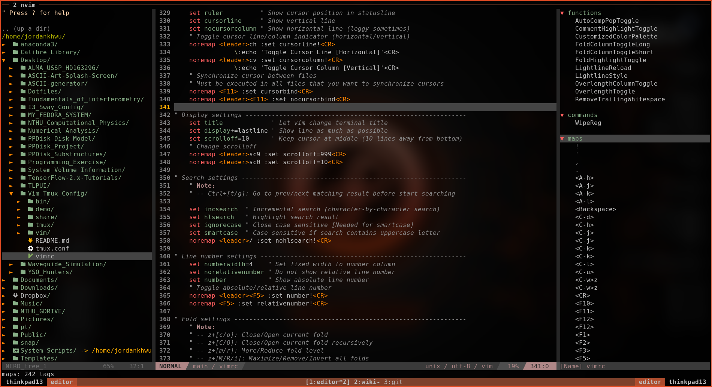

# Vim_Tmux_Config
Backup for my vim and tmux configuration

Table of Contents
=================

* [Vim_Tmux_Config](#vim_tmux_config)
* [Table of Contents](#table-of-contents)
   * [Demo Current Customization](#demo-current-customization)
   * [Part 1 - Vim/Gvim/Neovim](#part-1---vimgvimneovim)
      * [Preparation (Dependence)](#preparation-dependence)
         * [1. Common Requirement](#1-common-requirement)
         * [2. Requirement for Diverse Vim](#2-requirement-for-diverse-vim)
         * [3. Requirement for Python Completion](#3-requirement-for-python-completion)
      * [First Time Usage](#first-time-usage)
         * [1. Copy Configuration File](#1-copy-configuration-file)
         * [2. First Time Startup (Vim/Gvim/Neovim)](#2-first-time-startup-vimgvimneovim)
      * [Plugins](#plugins)
         * [1. Plugin Loading Time](#1-plugin-loading-time)
         * [2. Plugin Usage Configuration (for more details, check sections in vimrc)](#2-plugin-usage-configuration-for-more-details-check-sections-in-vimrc)
      * [Keymapping - Customized Keymapping Rule](#keymapping---customized-keymapping-rule)
      * [Keymapping Sheet 1 - Fn Key Keymapping](#keymapping-sheet-1---fn-key-keymapping)
         * [1. Function Key Keymapping](#1-function-key-keymapping)
      * [Keymapping Sheet 2 - Built-in Function Keymapping](#keymapping-sheet-2---built-in-function-keymapping)
         * [1. Split/Window Keymapping](#1-splitwindow-keymapping)
         * [2. Code Folding Keymapping](#2-code-folding-keymapping)
         * [3. Miscellaneous Function Keymapping](#3-miscellaneous-function-keymapping)
      * [Keymapping Sheet 3 - Plug-in Function Keymapping](#keymapping-sheet-3---plug-in-function-keymapping)
         * [1. File/Code Browsing Keymapping](#1-filecode-browsing-keymapping)
         * [2. Python Coding Keymapping](#2-python-coding-keymapping)
         * [3. Miscellaneous Function Keymapping](#3-miscellaneous-function-keymapping-1)
      * [Reference for VIM Setup](#reference-for-vim-setup)
   * [Part 2 - Tmux](#part-2---tmux)
      * [Preparation (Dependence)](#preparation-dependence-1)
         * [1. Common Requirement](#1-common-requirement-1)
         * [2. Requirement for Tmux](#2-requirement-for-tmux)
      * [First Time Usage](#first-time-usage-1)
         * [1. Copy Configuration File](#1-copy-configuration-file-1)
         * [2. First Time Startup (Tmux)](#2-first-time-startup-tmux)
      * [Plugins](#plugins-1)
         * [Installed Plugins](#installed-plugins)
      * [Major Difference Between Customized and Original](#major-difference-between-customized-and-original)
      * [Keymapping Sheet](#keymapping-sheet)
      * [Reference for TMUX Setup](#reference-for-tmux-setup)

## Demo Current Customization


## Part 1 - Vim/Gvim/Neovim

### Preparation (Dependence)

#### 1. Common Requirement
- __Curl__ [for plugin manager setup]
    ```bash
    # For Fedora
    dnf install curl
    ```
- __Web browser with markdown plugin__ (e.g. google-chrome, firefox, and etc.) [for markdown preview]
    ```bash
    # For Fedora
    dnf install firefox
    ```
- __PDF viewer__ (e.g. okular) [for latex preview]
    ```bash
    # For Fedora
    dnf install okular
    ```

#### 2. Requirement for Diverse Vim
- __Vim__
    - version >= __7.0__
    - clipboard option is on (+clipboard) [for sharing system clipboard]
    - python3 option is on (+python3/dyn) [for python completion]
    ```bash
    # Check vim version and other options
    vim --version
    ```
- __Gvim__
    - version >= __7.0__
    - gvim already shipped with clipboard and python3 options
    ```bash
    # Check gvim version and other options
    vim --version
    ```
- __Neovim__
    - version >= __0.4__
    - neovim already shipped with clipboard and python3 options
    ```bash
    # Check nvim version and other options
    nvim --version
    ```
#### 3. Requirement for Python Completion

- __ipython__ (version >= __7.20__) [python console]
    ```bash
    # Python3
    pip install ipython
    ```
- __jedi__ for jedi [python code analyzer]
    ```bash
    # Python3
    pip install jedi
    ```
- __pynvim__ for deoplete neovim plugin usage [python code analyzer]
    ```bash
    # Python3
    pip install pynvim
    ```
- __ipdb__ for ipdb [python breakpoint maker]
    ```bash
    # Python3
    pip install ipdb
    ```

### First Time Usage

#### 1. Copy Configuration File
- __Vim/Gvim__
    1. copy "vimrc" to $HOME (current user's home)
    2. rename "vimrc" to ".vimrc"
    ```bash
    cp vimrc $HOME/.vimrc
    ```
- __Neovim__
    1. copy "vimrc" to $HOME/.config/nvim (create one if not exists)
    2. rename "vimrc" to "init.vim"
    ```bash
    mkdir -p $HOME/nvim
    cp vimrc $HOME/nvim/init.vim
    ```

#### 2. First Time Startup (Vim/Gvim/Neovim)
- Following installation should start automatically at the first time startup
    1. vim-plug (plug manager) installation via __curl__
        - If not working, try manually install vim-plug (also within this repository)
            ```bash
            # For vim/gvim
            cp -r vim/autoload $HOME/.vim
            # For neovim
            cp -r vim/autoload $HOME/.config/nvim
            ```
    2. vim plugin installation via __vim-plug__
        - If not working, try manually install vim-Plug
            ```bash
            # In vim command line mode
            :Pluginstall
            ```

### Plugins
#### 1. Plugin Loading Time
- Enable too much plugins may slow down your vim. you can check your loading time with following command
- For managing plugins enable/disable, see next section (Plugin usage configuration)
```bash
# For vim/gvim
" vim --startuptime /tmp/startup.log [file_to_test] +q && vim /tmp/startup.log
# For neovim
" vim --startuptime /tmp/startup.log [file_to_test] +q && vim /tmp/startup.log
```

#### 2. Plugin Usage Configuration (for more details, check sections in vimrc)
- Plugin usage can be configured in the first section of vimrc
    ```vim
    " ============================================================================
    " Vim and Neovim settings
    " ============================================================================
    " Select vim-plug to load, set guicolor (real color) support, and etc.
    " Assign 0 to disable plug option
    ```
- Dectect using neovim or not (automatical detection)
    - Neovim is better for loading tons of plugins, some plugins is disabled for vim
    - Required for
        - [Plug-in] vim-startify (start page for empty buffer)
        - [Plug-in] comfortable-motion (physical movement)
        - [Plug-in] vim-tmux-focus-events, vim-tmux-clipboard (for tmux-vim interaction)
        - [Plug-in] deoplete.nvim (for python code completion)
        - [Plug-in] minimap (minimap scrollbar), also required neovim version > 0.5
        - [Plug-in] goyo (distraction-free edtior)
    ```vim
    " Use vim or neovim (Auto-detect)
    let using_neovim = has('nvim')
    let using_vim = !using_neovim
    ```
- Check if using vim 8.0 or higher
    - If vim version is less than 8.0, some function is not vailable (e.g. terminal)
    - Required for
        - [Built-in] terminal mode
        - [Plug-in] vim-polyglot (multi-language support)
        - [Plug-in] ale (multi-lanaguage syntax highlight)
    ```vim
    " Check vim version for remote machine that vim <= 8.0 (e.g. Fomalhaut)
    let using_vim8 = 1
    ```
- Customize vim colorscheme
    - For fancy symbol support, nerd font is needed (check https://github.com/ryanoasis/nerd-fonts)
    - For pywal theme support, pywal is needed (check https://github.com/dylanaraps/pywal), also remember to change the directory path to your $HOME/.cache/wal
    ```vim
    " Customize vim theme (Include colortheme and statusline)
    let using_customized_theme = 1
    " Fancy symbols (Mainly affect lightline)
    let using_fancy_symbols = 1
    " Wal theme support (Pywal theme support, check pywal [Default NO])
    let using_wal_theme = 0
    "let using_wal_theme = isdirectory('/home/jordankhwu/.cache/wal')
    ```
- Extra vim-plug
    - Extra plug for productivity (or enhance vim-built in function)
    - Including
        - [Plug-in] vim-startify (start page for empty buffer)
        - [Plug-in] comfortable-motion (physical movement)
        - [Plug-in] goyo (distraction-free edtior)
        - [Plug-in] yankring (clipboard history)
        - [Plug-in] vim-peekaboo (vim register manager)
        - [Plug-in] vim-easymotion (physical movement)
        - [Plug-in] autocomplpop (auto completion popup)
        - [Plug-in] fixedtasklist (find TODO tag in vim)
        - [Plug-in] vim-hexokinase (hex colorcode color highlight support)
    ```vim
    " Extra vim-plug (Include easymotion, yankring, autocomplpop, and etc.)
    let using_extra_plug = 1
    ```
- Coding tool vim-plug
    - Tools for coding, git, language syntax highlight
    - Including
        - [Plug-in] vim-polyglot (multi-language support)
        - [Plug-in] ale (multi-lanaguage syntax highlight)
        - [Plug-in] neoformat (code prettifier)
        - [Plug-in] rainbow (pair bracket highlight)
        - [Plug-in] indentLine (indent line indicator)
        - [Plug-in] vim-indent-guides (indent highlight)
        - [Plug-in] vim-indent-object (add indent object to vim)
        - [Plug-in] vim-multiple-cursors (multiple cursors)
        - [Plug-in] vim-fugitive (git toolbox)
        - [Plug-in] vim-gitgutter (git diff highlight)
        - [Plug-in] minimap (minimap scrollbar)
    ```vim
    " Coding tools vim-plug (Include syntax support, git function, and etc.)
    let using_coding_tool_plug = 1
    ```
- Python completion vim-plug
    - Tools for python completion
    - Requirements must be satisfied (check python completion preparation at the first session)
    - Including
        - [Plug-in] nvim-yarp (yet another remote plugin framework for neovim)
        - [Plug-in] vim-hug-neovim-rpc (plugin bridge from neovim to vim)
        - [Plug-in] deoplete-jedi (python completeion)
        - [Plug-in] context_filetype.vim (completion from other opened files)
        - [Plug-in] jedi-vim (definition and feature finder)
    ```vim
    " Python Completion (Use deoplete and jedi, neovim is recommended to be used)
    let using_python_completion = 1
    " Python that used for jedi and pynvim installation, change '_..._ ' to your python
    let python_for_completion = '_python_for_jedi_pynvim_installation_'
    ```
- GUI support
    - Functions for external GUI software
    - Required for
        - Latex previewer
        - Markdown previewer
    ```vim
    " Support of externaml gui software (e.g. Okular, Google-chrome, and etc.)
    let using_gui_software = 1
    ```

### Keymapping - Customized Keymapping Rule
> 1. Keymapping should not be much different from the original VIM
- To make life easier instead of filled up with bloated keymapping
> 2. Every function (motion) should start with a leader key for most of time
- To prevent conflict with built-in hotkey or other program hotkeys
- In this configuration is __SPACE__ key
> 3. Keymapping should be related to the name of the function
- Make it easier to remember or connect
- e.g. "no wrap" function is mapped to [SPACE]+[W]+[P]

### Keymapping Sheet 1 - Fn Key Keymapping

#### 1. Function Key Keymapping
| VIM-Mode | Keymapping                  | Function                      | Description                           | Note |
| :-----:  | :-------------------------: | :---------------------------: | :-----------------------------------: | :--: |
| N/V      | ([LK])+[F1]                 | (Previous)/Next Buffer        | Switch between buffers                |
| N/V      | ([LK])+[F2]                 | (Previous)/Next Tab           | Switch between tabs                   |
| N/V      | [F3]                        | Nerdtree current file         | Show current file location            |
| N/V      | [LK]+[F3]                   | Toggle Nerdtree               | On/Off NerdTree plugin                |
| N/V      | [F4]                        | Markdown/Latex previewer      | Open external Viewer                  | Only for .md or .tex file |
| N/V      | [LK]+[F4]                   | Toggle Tagbar                 | On/Off Tagbar plugin                  |
| N/V      | ([LK])+[F5]                 | Toggle (Rel)/Abs linenumber   | On/Off rel/abs linenumber             |
| N/V      | [F6]                        | Toggle foldcolumn             | On/Off foldcolumn                     | For easier code fold visualization |
| N/V      | [F7]                        | Toggle show line border       | On/Off hightlight 79th character      | VIM recommends at most 78 characters for one line |
| N/V      | [LK]+[F7]                   | Toggle show line border       | On/Off hightlight 79th column         | VIM recommends at most 78 characters for one line |
| N/V      | [F8]                        | Toggle highlight comment      | On/Off hightlight code comment        | Assign brighter color to comment to hightlight it |
| N/V      | [F9]                        | Toggle indent highlight (line)  | On/Off indent highlight (line)      |
| N/V      | [LK]+[F9]                   | Toggle indent highlight (block) | On/Off indent highlight (block)     |
| N/V      | ([LK])+[F10]                | (Load)/Save vim layout        | Load/Save vim layout                  | Including pane split, folds, and etc. |
| N/V      | ([LK])+[F11]                | (OFF)/ON synchronized cursor  | Off/On synchronized cursor            | Need to execute in every pane that wants to synchronize |
| N/V      | ([LK])+[F12]                | (Exit)/Enter terminal mode    | Exit/Enter terminal mode              |

### Keymapping Sheet 2 - Built-in Function Keymapping

#### 1. Split/Window Keymapping
| VIM-Mode | Keymapping                  | Function                      | Description                           | Note |
| :-----:  | :-------------------------: | :---------------------------: | :-----------------------------------: | :--: |
| N/V      | [Ctrl]+[w]+[-/\\]           | Add new split Horiz/Vertical  | Add new split Horizontal/Vertial      |
| N/V      | [Ctrl]+[w]+[Shift]+[-/\\]   | Add current split Horiz/Verti | Add current split Horizontal/Vertial  | Duplicate original split, just add [Shift] to [-]/[\]| |
| N/V      | [Ctrl]+[h/j/k/l]            | Move between vim splits       | Move between splits (L/D/U/R)         | With plugin, you can even move between TMUX pane and VIM splits |
| N/V      | [Ctrl]+[w]+[h/j/k/l]        | Move between vim splits       | Move between splits (L/D/U/R)         |
| N/V      | [Ctrl]+[w]+[Shift]+[h/j/k/l] | Move current split (L/D/U/R) | Move current split (L/D/U/R)          |
| N/V      | [-/=]                       | Inc/Dec split height          | +5/-5 rows split height               |
| N/V      | [Shift]+[-/=]               | Inc/Dec split width           | +5/-5 columns split width             | Just add [Shift] to [-]/[=] |
| N/V      | [Ctrl]+[w]+[=]              | Resplit splits equally        | Resplit splits equally                | Here =(equal sign) for equally split

#### 2. Code Folding Keymapping
| VIM-Mode | Keymapping                  | Function                      | Description                           | Note |
| :-----:  | :-------------------------: | :---------------------------: | :-----------------------------------: | :--: |
| N        | ([LK])+[F10]                | Load/Save layout and folding  | Load/Save current split and code folding |
| N/V      | [z]+[k/j]                   | Goto Prev/Next folding        | Goto Prev/Next folding                | Vim built-in |
| N/V      | [z]+[o/c]                   | Open/Close current folding    | Open/Close current folding            | Vim built-in |
| N/V      | [z]+[Shift]+[r/m]           | Show/Close all foldings       | Show/Close all foldings               | Vim built-in |
| V        | [Shift]+[k/j]               | Move selection block up/down  | Move selection block up/down          |

#### 3. Miscellaneous Function Keymapping
| VIM-Mode | Keymapping                  | Function                      | Description                           | Note |
| :-----:  | :-------------------------: | :---------------------------: | :-----------------------------------: | :--: |
| I        | [i]+[i]/[k]+[j]             | Esc (escape form insert mode) | Esc (escape form insert mode)         | If your word contains "ii", try [i] + "[Ctrl]+[v]" + [i]
| N/V      | [Shift]+[k]                 | Search current word in mannual| Search current word in mannual        |
| N/V      | [LK]+[d]+[d]                | Close current buffer          | Close current buffer                  | Here d for (d)eletion
| N/V      | [LK]+[w]+[p]                | Toggle line wrap              | On/Off line wrap                      | Here wp for (w)ra(p)
| N/V      | [LK]+([Shift])+[/]          | Toggle search highlight       | On/Off search highlight               |
| N/V      | [LK]+[m]+[k]                | Show all vim marks            | Show all vim marks                    | [LK]+[m]+[k] shows marks using fzf instead vim built-in
| N/V      | [LK]+[r]+[g]                | Show all vim regiesters       | Show all vim registers                | Here re for (re)gister
| N/V      | [LK]+[a]+[b]                | Show all vim abbreviates      | Show all vim abbreviates              | Here ab for (ab)reviation
| N/V      | [LK]+[c]+[h/v]              | Toggle Horiz/Verti cursor     | On/Off Horiz/Verti cursor             |
| N/V      | [LK]+[Ctrl]+[o]             | Show all cursor jump          | Show all cursor jump                  | [Ctrl]+[o/i] jump backwards/forwards |
| N/V      | [LK]+[g]+[;/,]              | Show all file change          | Show all file change                  |

### Keymapping Sheet 3 - Plug-in Function Keymapping

#### 1. File/Code Browsing Keymapping
- Note: Fzf is needed for file browsing

| VIM-Mode | Keymapping                  | Function                      | Description                           | Note |
| :-----:  | :-------------------------: | :---------------------------: | :-----------------------------------: | :--: |
| N/V      | [F3]                        | Nerdtree Current Files        | Show current file location            |
| N/V      | [LK]+[F3]                   | Toggle Nerdtree               | On/Off NerdTree plugin                |
| N/V      | [LK]+[F4]                   | Toggle Tagbar                 | On/Off Tagbar plugin                  |
| N        | [LK]+[f]+[f]+[s]            | List files under input dir    | List files under input dir            |
| N        | [LK]+[f]+[l]+[c]            | Locate files matched input    | Locate files matched input name       | Use system locate command |
| N        | [LK]+[f]+[r]+[g]            | Find files with input pattern | Find files matched input patterm      | Use system ripgrep command |
| N        | [LK]+[f]+[f]+[t]            | Select filetype for current   | Select filestype for current file     |
| N        | [LK]+[f]+[c]+[d]            | Show all command in vim now　 | Show all command in vim now           |　
| N        | [LK]+[f]+[n]+[m]            | Show all normal mode mapping  | Show all normal mode mapping          |
| N        | [LK]+[f]+[h]+[t]            | Show all helptag in vim-help  | Show all helptag in vim-help          |

#### 2. Python Coding Keymapping
- Note: Jedi is needed for python code analysis (Check https://github.com/davidhalter/jedi)
- Note: All below functions only work in .py files

| VIM-Mode | Keymapping                  | Function                      | Description                           | Note |
| :-----:  | :-------------------------: | :---------------------------: | :-----------------------------------: | :--: |
| N/V      | [Shift]+[k]                 | Search current word in doc    | Search current word in python doc     |
| N/V      | [LK]+[p]+[n]                | Find current word occurences  | Find current word occurences          | Here p for (p)ython |
| N/V      | [LK]+[p]+[a]                | Find current word assignment  | Find current word assignment          |
| N/V      | [LK]+[p]+[d]                | Show current word definition  | Show current word definition          |
| N/V      | [LK]+[p]+[m]                | Show current word init.py     | Show current word init.py             |
| N/V      | [LK]+[p]+[Shift]+[m]        | Show input module init.py     | Show input module init.py             |

#### 3. Miscellaneous Function Keymapping
- Useful tool (Note: startup by default)

| VIM-Mode | Keymapping                  | Function                      | Description                           | Note |
| :-----:  | :-------------------------: | :---------------------------: | :-----------------------------------: | :--: |
| N/V      | [LK]+[c]+[c/y]              | Comment (and copy) current line | Comment (and copy) current line     | NerdCommenter |
| N/V      | [LK]+[c]+[u]                | Uncomment current line        | UnComment current line                | NerdCommenter |
| N/V      | [LK]+[Return]               | Select vim pane               | Select vim pane in tabs and splits    | vim-choosewin
| N/V      | [LK]+[z]                    | Toggle maximize current split | On/Off maximize current split         | vim-maximizer |
| N/V      | [y]+[s]+[a]+[w]+["]         | Add wrapped quotation/bracket | From word to "word"                   | vim-surrounder |
| N/V      | [d]+[s]+[a]+[w]+["]         | Del wrapped quotation/bracket | From "word" to word                   | vim-surrounder |
| N/V      | [c]+[s]+[']+["]             | Change quotation/bracket      | From 'word' to "word"                 | vim-surrounder |
| N/V/I    | [Alt]+[a]                   | Toggle auto-pair              | On/Off auto-pair quotation/bracket    | auto-pairs |
| N/V/I    | [Alt]+[j]                   | Jump to next pairs            | Jump to next paired quotation/bracket | auto-pairs |
| I        | [Alt]+[w]                   | Auto-pair fastwrap            | Auto-pair fastwrap current pairs      | Example: ()test -> (test) |

- Extra plug (Note: "let using_extra_plug = 1" must be set in vimrc)

| VIM-Mode | Keymapping                  | Function                      | Description                           | Note |
| :-----:  | :-------------------------: | :---------------------------: | :-----------------------------------: | :--: |
| N        | [Ctrl]+[f/b]                | Move down/up physically       | Move down/up physically               | comfortable-motion.vim |
| N/V      | [LK]+[h/j/k/l]              | Quick move in four direction  | Quick move in four direction          | vim-easymotion |
| N/V      | [Ctrl]+[n/p]                | Paste next/prev clipped item  | Paste next/prev clipped item          | yankring |

- Coding tool (Note: "let using_coding_tool_plug = 1" must be set in vimrc)

| VIM-Mode | Keymapping                  | Function                      | Description                           | Note |
| :-----:  | :-------------------------: | :---------------------------: | :-----------------------------------: | :--: |
| N/V      | [LK]+[m]+[m]                | Toggle code minimap scrollbar | On/Off code minimap scrollbar         | For neovim version >= 0.5, and minicode is installed |
| N/V      | [Alt]+[n] (+[n]+[n]+...+[n] | Multiple cursor for selected  | Multiple cursor for currently selected word | Press N to next word; Use I/A to insert word; Use Esc to exit |
| N/V      | [Alt]+[p] (+[p]+[p]+...+[p] | Cancel selected multiple cursor | Cancel selected multiple cursor     |
| N/V      | [Alt]+[o] (+[o]+[o]+...+[o] | Omit selected multiple cursor | Omit selected multiple cursor     |
| N/V      | [LK]+[g]+[g]                | Toggle GitGutter              | On/Off GitGutter                      | Disabled at startup |
| N/V      | [LK]+[g]+[h]+[s/l/n]        | Toggle GitGutter highlight    | Toggle GitGutter highlight symbol/line/line number |
| N/V      | [LK]+([Shift])+[Tab]        | Cycle (Prev)/Next git hunks   | Cycle (Prev)/Next git hunks           | Hunk means changed block |
| N/V      | [LK]+[g]+[n]                | Next git hunk                 | Move to next git hunk                 |
| N/V      | [LK]+[g]+[p/N]              | Previous git hunk             | Move to previous git hunk             |
| N/V      | [LK]+[g]+[s]                | Hunk preview (before changed) | Hunk preview (before changed)         | Here s for (s)how_preview |
| N/V      | [LK]+[g]+[Shift]+[f]        | Fold all unchanged lines      | Fold all unchanged lines              |
| N/V      | [LK]+[g]+[Shift]+[s]        | Stage current hunk            | Stage current hunk                    | Here s for (s)tage |
| N/V      | [LK]+[g]+[Shift]+[u]        | Restore current hunk          | Restore current hunk                  | Like vim undo |
| N/V      | [LK]+[g]+([Shift])+[d]      | Git diff (all unstaged files) | Git diff (all unstaged files)         |
| N/V      | [LK]+[g]+([Shift])+[a]      | Git add (all unstaged files)  | Git add (all unstaged files)          |
| N/V      | [LK]+[g]+([Shift])+[c]      | Git commit -m (all unstaged files) | Git commit -m (all unstaged files) |
| N/V      | [LK]+[g]+[Shift]+[b]        | Git blame current file        | Git blame current file                |

### Reference for VIM Setup
- http://fisadev.github.io/fisa-vim-config/
- https://github.com/ryanoasis/nerd-fonts/
- https://github.com/sbdchd/Neoformat
- https://github.com/amix/vimrc/blob/master/vimrcs/basic.vim
- https://vim.wikia.com/wiki/Disable_beeping
- https://blog.gtwang.org/useful-tools/how-to-use-vim-as-a-hex-editor/
- https://github.com/junegunn/vim-plug
- https://krehwell.com/blog/Open%20Markdown%20Previewer%20Through%20Vim
- https://github.com/shengjunlin/vimrc
- http://nadypan.blogspot.com/2014/01/vim-fold.html
- https://github.com/yangyangwithgnu/use_vim_as_ide
- https://factorpad.com/tech/vim-cheat-sheet.html#structure
- https://github.com/wsdjeg/vim-galore-zh_cn
- https://github.com/mhinz/vim-galore
- https://ahuigo.github.io/b/vim/vim-var#/
- https://learnvimscriptthehardway.stevelosh.com/chapters/24.html

## Part 2 - Tmux

### Preparation (Dependence)

#### 1. Common Requirement
- __Git__ [for tmux plugin manager setup]
```bash
# For Fedora
dnf install git
```
- __Powerline__ [for statusline powerline support]
```bash
# For Fedora
dnf install powerline
dnf install tmux-powerline
```

#### 2. Requirement for Tmux
- verion >= __2.0__
```bash
# Check tmux version
tmux -V
```

### First Time Usage

#### 1. Copy Configuration File
- __Tmux__
    1. copy "tmux.conf" to $HOME (current user's home)
    2. rename "tmux.conf" to .tmux.conf
    ```bash
    cp tmux.conf $HOME/.tmux.conf
    ```
#### 2. First Time Startup (Tmux)
- At first time startup, we need to install tmux plugin manager, load configuration file and install plugins
    1. Tmux plugin manager (TPM) installation
    ```bash
    # In terminal
    git clone https://github.com/tmux-plugins/tpm $HOME/.tmux/plugins/tpm
    ```
    2. Load configuration file
    ```bash
    # Open tmux in terminal
    tmux
    # In tmux, press ctrl+b to enter command mode
    # In command mode
    source-file ~/.tmux.conf
    ```
    3. Install plugins
        - Press "Ctrl+Space", then "I"
        - Plugin manager should start installation automatically

### Plugins

#### Installed Plugins
- [Plug-in] tmux-resurrect (save tmux layout, and restore after restart tmux)
- [Plug-in] tmux-continuum (save program running in tmux, and restore after restart tmux)
- [Plug-in] vim-tmux-navigator (move between vim and tmux pane seamlessly)
- [Plug-in] tmux-yank (share tmux clipboard with system clipboard)

### Major Difference Between Customized and Original
- Bindkey is remapped from "Ctrl+b" to "Ctrl+space"
- Command related to pane and split is remapped to my vim-like keymapping to keep things consistent
- Add new powerline theme to make press of bindkey more eye-catching
- Add clipboard sharing between vim and system

### Keymapping Sheet
| TMUX-Mode  | Add-on key                  | Function                      | Description                           | Note |
| :-------:  | :-------------------------: | :---------------------------: | :-----------------------------------: | :--: |
| Normal     | [BK]+[?]                    | Show all tmux keymapping      | Show all tmux keymapping              |
| Normal     | [BK]+[r]                    | Reload tmux configuration     | Reload tmux configuration             | .tmux.conf file |
| Normal     | [BK]+[d]                    | Reattach remote/local display | Reattach remote/local display         | Run script to make sure display connection is the same for both remote and local machine |
| Normal     | [BK]+[s]                    | Show all tmux sessions        | Show all tmux sessions                |
| Normal     | [BK]+[_]                    | Split window vertically       | Split window vertically               | Default key is [LK]+["] |
| Normal     | [BK]+[|]                    | Split window horizontally     | Split window horizontally             | Default key is [LK]+[%] |
| Normal     | [BK]+[q]                    | Move to pane (number)         | Move to pane (number)                 | Pane number shows on pane |
| Normal     | [Ctrl]+[h/j/k/l]            | Move to pane (L/D/U/R)        | Move to pane (L/D/U/R)                | Also work with vim pane |
| Normal     | [BK]+[h/j/k/l]              | Move to pane (L/D/U/R)        | Move to pane (L/D/U/R)                |
| Normal     | [BK]+[H/J/K/L]              | Swap pane to (L/D/U/R)        | Swap pane to (L/D/U/R)                |
| Normal     | [BK]+[[]+[Space]            | Enter copy mode and select    | Enter copy mode and select            |
| Copy       | [BK]+[]]                    | Copy selected contents        | Copy selected contents                | Copy to shared clipboard (with system and vim) |
| Normal     | [BK]+[<\/>]                 | Inc/Dec horizontal pane size  | Inc/Dec horizontal pane size          |
| Normal     | [BK]+[-/+]                  | Inc/Dec vertical pane size    | Inc/Dec vertical pane size            |
| Normal     | [Ctrl]+[L/R]                | Move to (L/R) window          | Move to (L/R) window                  |
| Normal     | [Shift]+[L/R]               | Swap to (L/R) window          | Swap to (L/R) window                  |

### Reference for TMUX Setup
- https://github.com/powerline/powerline
- https://github.com/erikw/tmux-powerline
- https://github.com/tmux-plugins/tmux-resurrect
- https://github.com/tmux-plugins/tmux-sidebar
- https://github.com/tmux-plugins/tmux-yank
- https://github.com/g6ai/dotfiles/tree/master/tmux
- https://danielmiessler.com/study/tmux/
- https://leimao.github.io/blog/Tmux-Tutorial/
