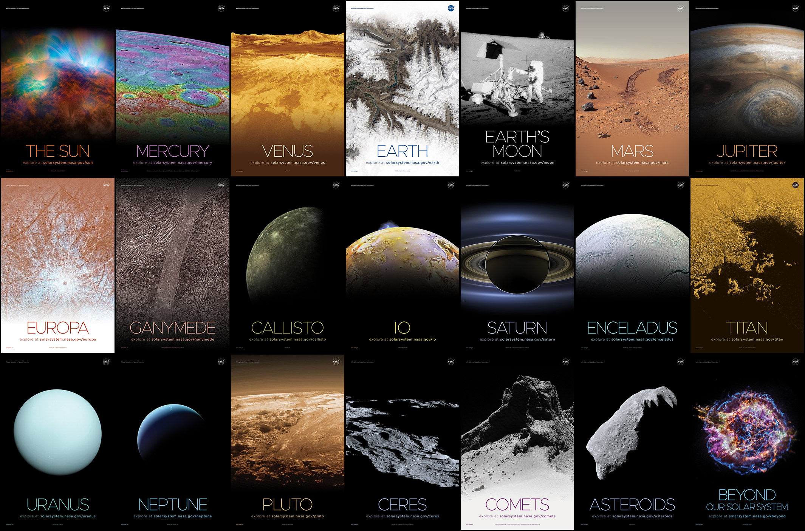

# Pandoc Image Rendering Test

> **Demonstration:** Standard Markdown syntax vs. HTML `` tag syntax in Pandoc exports.

---

## 1. Example A: Standard Markdown Image Syntax

This image is embedded using standard Markdown syntax. Pandoc recognizes this natively across all export targets (PDF, DOCX, EPUB, LaTeX).



* **Expected Output:** Rendered properly in PDF, DOCX, HTML, and LaTeX.

---

## 2. Example B: HTML `` Tag Syntax

This image is embedded using an HTML `` tag with custom styling.


* **Expected Output in HTML export:** Rendered correctly.
* **Expected Output in PDF / DOCX / LaTeX export:** Ignored, stripped out, or converted to raw plain text because Pandoc's core AST does not parse inline HTML tags into image nodes for non-HTML output formats unless raw HTML parsing extensions are explicitly configured.

---

## 3. Recommended Pandoc Command to Verify

Run the following command in your terminal to see how Pandoc handles both tags when exporting to PDF or Word:

```bash
# Export to PDF (Notice Example B fails or is skipped)
pandoc input.md -o output.pdf

# Export to DOCX
pandoc input.md -o output.docx
