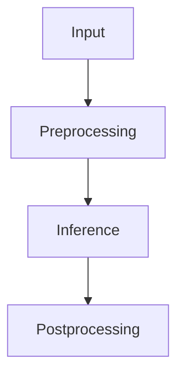
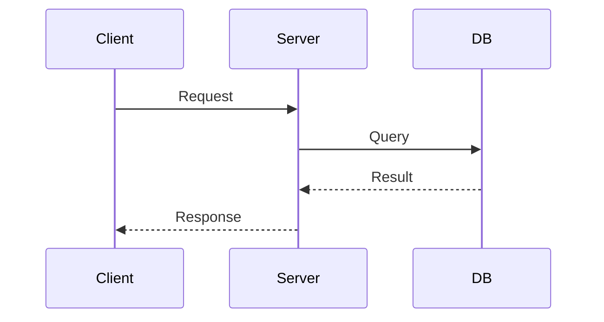
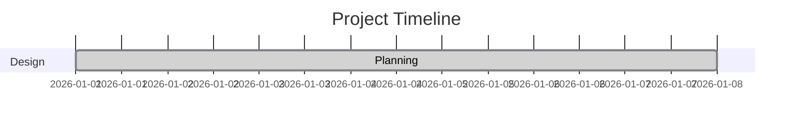
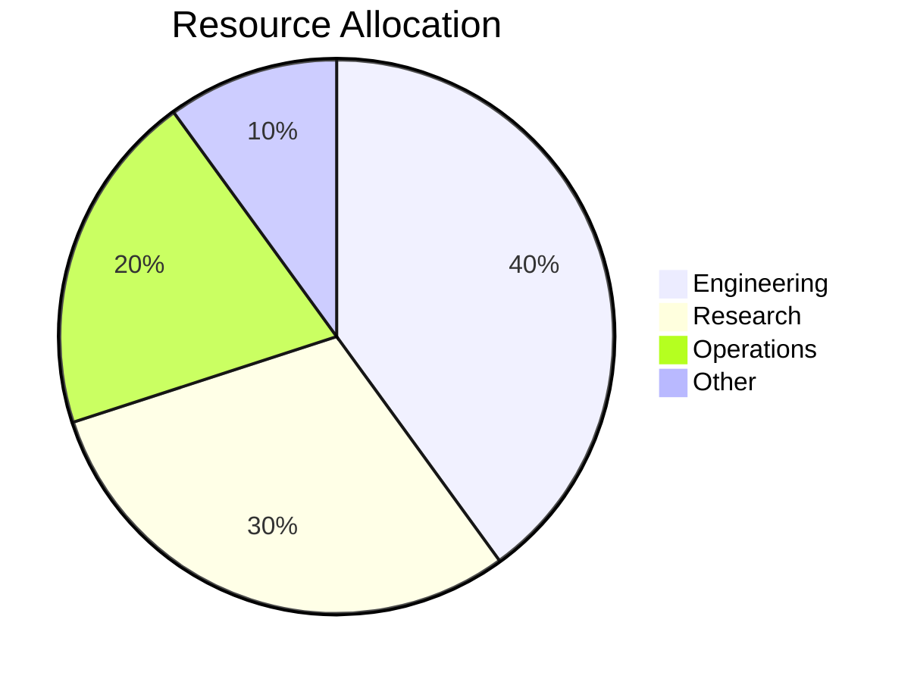
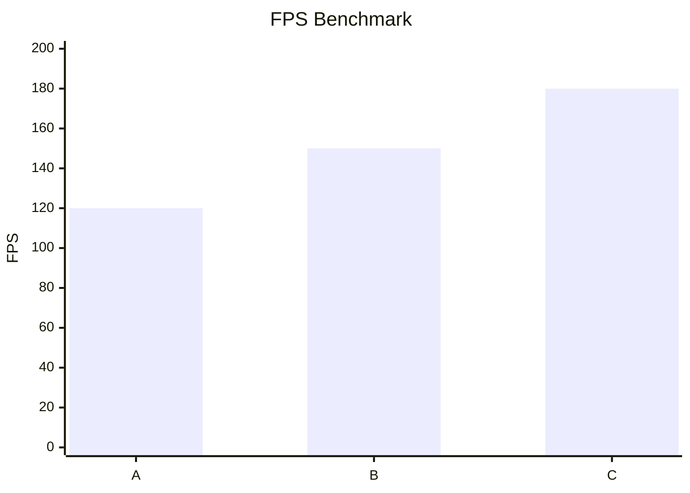
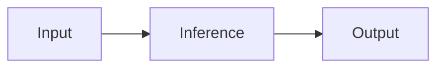

# Comprehensive Marp Slide Template & Cookbook

A complete, self-documented Marp markdown template collection covering:

- Cover slides
- Agenda slides
- Bullet lists
- Ordered lists
- Tables
- Images
- Background images
- Side-by-side layouts
- Code blocks
- Charts
- Mermaid flowcharts
- Quotes
- Notes
- Footnotes
- References
- Page numbering
- Themes & styling
- Columns
- Alerts / callouts
- Timeline slides
- Comparison slides
- Data-heavy slides
- Speaker notes
- Appendix
- Backup slides
- PDF export preparation
- Presenter mode
- Custom CSS classes
- Reusable utility classes
- Print-safe layouts
- Corporate style customization
- Accessibility considerations
- Animation alternatives
- Multi-theme organization

---

# 1. Introduction

## What is Marp?

Marp is a Markdown Presentation Ecosystem that converts Markdown into beautiful slides.

Main tools:

- Marp CLI
- VSCode Marp Extension
- Marpit
- Marp Core

Official website:

- https://marp.app/

---

# 2. Recommended Directory Structure

```text
slides/
├── assets/
│   ├── images/
│   ├── logos/
│   ├── charts/
│   └── icons/
├── themes/
│   ├── corporate.css
│   ├── dark.css
│   └── minimal.css
├── references/
│   └── refs.md
├── output/
│   ├── pdf/
│   └── html/
├── deck.md
└── Makefile
```

---

# 3. Minimal Base Template

```markdown
---
marp: true
theme: default
paginate: true
footer: "My Presentation"
header: "Confidential"
style: |
  section {
    font-family: 'Inter', 'Noto Sans', sans-serif;
    font-size: 30px;
  }
---

# Hello Marp

Welcome to the presentation.
```

---

# 4. Core Front Matter Options

## Common Global Options

```yaml
---
marp: true
theme: default
paginate: true
size: 16:9
header: "Header Text"
footer: "Footer Text"
style: |
  section {
    background: #ffffff;
    color: #222222;
  }
---
```

## Supported Sizes

```yaml
size: 16:9
size: 4:3
```

## Per-slide Directives

```markdown
<!-- _class: lead -->
<!-- _paginate: false -->
<!-- _backgroundColor: #101010 -->
<!-- _color: white -->
```

---

# 5. Recommended Global Styling Template

```markdown
---
marp: true
theme: default
paginate: true
footer: "Internal Use Only"
style: |
  :root {
    --color-primary: #1565c0;
    --color-secondary: #37474f;
    --color-accent: #ef6c00;
    --color-bg: #ffffff;
    --color-text: #202124;
    --color-muted: #5f6368;
    --color-success: #2e7d32;
    --color-warning: #ed6c02;
    --color-danger: #d32f2f;

    --font-main: 'Inter', 'Noto Sans', sans-serif;
    --font-mono: 'JetBrains Mono', monospace;
  }

  section {
    font-family: var(--font-main);
    background: var(--color-bg);
    color: var(--color-text);
    padding: 50px;
    font-size: 28px;
    line-height: 1.4;
  }

  h1 {
    color: var(--color-primary);
    font-size: 2.0em;
    border-bottom: 3px solid var(--color-primary);
    padding-bottom: 0.2em;
  }

  h2 {
    color: var(--color-secondary);
  }

  code {
    font-family: var(--font-mono);
    background: #f5f5f5;
    padding: 0.1em 0.3em;
    border-radius: 6px;
  }

  pre {
    border-radius: 12px;
    padding: 16px;
    overflow: hidden;
  }

  table {
    width: 100%;
    border-collapse: collapse;
    font-size: 0.8em;
  }

  th {
    background: var(--color-primary);
    color: white;
  }

  td, th {
    border: 1px solid #cccccc;
    padding: 10px;
  }

  blockquote {
    border-left: 6px solid var(--color-primary);
    padding-left: 16px;
    color: var(--color-muted);
  }

  img {
    max-width: 100%;
    max-height: 70vh;
  }

  .columns {
    display: grid;
    grid-template-columns: 1fr 1fr;
    gap: 24px;
  }

  .small-text {
    font-size: 0.7em;
  }

  .tiny-text {
    font-size: 0.55em;
  }

  .center {
    text-align: center;
  }

  .right {
    text-align: right;
  }

  .warning {
    color: var(--color-warning);
    font-weight: bold;
  }

  .danger {
    color: var(--color-danger);
    font-weight: bold;
  }

  .success {
    color: var(--color-success);
    font-weight: bold;
  }
---
```

---

# 6. Cover Slide Templates

## Basic Cover

```markdown
<!-- _class: lead -->
<!-- _paginate: false -->

# Project Title

## Subtitle

Author Name

2026-05-21
```

## Corporate Cover

```markdown
<!-- _class: lead -->
<!-- _backgroundImage: url('./assets/images/cover.jpg') -->
<!-- _color: white -->

# AI Infrastructure Review

## Q2 2026 Technical Report

Prepared by Platform Engineering
```

## Minimal Cover

```markdown
<!-- _class: lead -->

# Kubernetes Migration

Small subtitle here
```

---

# 7. Agenda / TOC Slides

## Standard Agenda

```markdown
# Agenda

1. Introduction
2. Architecture
3. Performance
4. Benchmark
5. Future Work
6. Q&A
```

## Section-Based Agenda

```markdown
# Presentation Structure

## Part 1
- Overview
- Requirements

## Part 2
- Design
- Deployment

## Part 3
- Benchmark
- Conclusions
```

---

# 8. Bullet List Slides

## Standard Bullet List

```markdown
# Features

- Fast
- Modular
- Extensible
- Cross-platform
```

## Nested Bullet List

```markdown
# Components

- Backend
  - API
  - Database
  - Cache

- Frontend
  - UI
  - State Management
```

## Incremental Reveal

```markdown
# Key Ideas

- First Point
<!-- pause -->

- Second Point
<!-- pause -->

- Third Point
```

Note:

Incremental reveal support depends on exporter and renderer.

---

# 9. Ordered List Slides

```markdown
# Deployment Steps

1. Install Docker
2. Pull Image
3. Configure Environment
4. Start Services
5. Verify Health
```

---

# 10. Task List Slides

```markdown
# Status

- [x] Design
- [x] Prototype
- [ ] Production Rollout
- [ ] Monitoring
```

---

# 11. Table Slides

## Basic Table

```markdown
# Benchmark Results

| Model | FPS | Accuracy |
|------|------|------|
| A | 120 | 91% |
| B | 140 | 89% |
| C | 90 | 95% |
```

## Wide Table

```markdown
<!-- _class: small-text -->

# Large Dataset

| Column A | Column B | Column C | Column D | Column E |
|---|---|---|---|---|
| ... | ... | ... | ... | ... |
```

## Styled HTML Table

```html
<table>
<tr>
<th>System</th>
<th>Status</th>
</tr>
<tr>
<td>GPU Cluster</td>
<td><span style="color:green">Healthy</span></td>
</tr>
</table>
```

---

# 12. Image Slides

## Single Image

```markdown
# Architecture Diagram


```

## Image with Caption

```markdown
# Detection Result


*Figure 1. Detection pipeline output.*
```

## Side-by-Side Images

```markdown
<div class="columns">
<div>

### Before


</div>
<div>

### After


</div>
</div>
```

## Full Background Image

```markdown
<!-- _backgroundImage: url('./assets/images/bg.jpg') -->
<!-- _color: white -->

# Background Slide
```

## Image Positioning

```markdown


# Left Content

Text on the left side.
```

---

# 13. Video Embedding

## HTML Video

```html
<video controls width="1000">
  <source src="demo.mp4" type="video/mp4">
</video>
```

Note:

Works better in HTML export than PDF.

---

# 14. Code Slides

## Basic Code Block

````markdown
# Python Example

```python
for i in range(10):
    print(i)
```
````

## Bash Example

````markdown
# Deployment

```bash
docker compose up -d
```
````

## JSON Example

````markdown
```json
{
  "name": "example",
  "version": "1.0"
}
```
````

## Highlighted Lines

````markdown
```python {2,4}
def add(a, b):
    result = a + b
    print(result)
    return result
```
````

---

# 15. Column Layouts

## Two Columns

```markdown
<div class="columns">
<div>

# Left

- Item A
- Item B

</div>
<div>

# Right

- Item C
- Item D

</div>
</div>
```

## Three Columns

```html
<div style="display:grid;grid-template-columns:1fr 1fr 1fr;gap:20px;">
<div>

### A
Text

</div>
<div>

### B
Text

</div>
<div>

### C
Text

</div>
</div>
```

---

# 16. Quote Slides

## Simple Quote

```markdown
> Simplicity is prerequisite for reliability.

— Edsger W. Dijkstra
```

## Large Quote Slide

```markdown
<!-- _class: lead -->

> Good architecture minimizes future regret.
```

---

# 17. Alert / Callout Slides

## Warning

```markdown
# Warning

<span class="warning">
Production environment ahead.
</span>
```

## Success

```markdown
# Deployment Status

<span class="success">
Deployment completed successfully.
</span>
```

## Danger

```markdown
# Critical Issue

<span class="danger">
Database replication failure detected.
</span>
```

---

# 18. Mermaid Flowcharts

## Enable Mermaid

Use Marp CLI with Mermaid support.

## Flowchart Example

````markdown

````

## Sequence Diagram

````markdown

````

## Gantt Chart

````markdown

````

---

# 19. Charts

## Mermaid Pie Chart

````markdown

````

## Mermaid XY Chart

````markdown

````

## External Chart Images

Recommended for:

- Complex plots
- Scientific charts
- Matplotlib outputs
- Plotly exports

Example:

```markdown

```

---

# 20. Timeline Slides

## Simple Timeline

```markdown
# Timeline

- 2026 Q1 — Planning
- 2026 Q2 — Prototype
- 2026 Q3 — Testing
- 2026 Q4 — Production
```

## HTML Timeline

```html
<div style="display:flex;justify-content:space-between;">
<div>
<h3>Q1</h3>
<p>Planning</p>
</div>
<div>
<h3>Q2</h3>
<p>Implementation</p>
</div>
<div>
<h3>Q3</h3>
<p>Testing</p>
</div>
</div>
```

---

# 21. Comparison Slides

## Feature Comparison

```markdown
# Comparison

| Feature | System A | System B |
|---|---|---|
| Speed | Fast | Medium |
| Accuracy | High | High |
| Cost | Medium | Low |
```

## Side-by-Side Comparison

```markdown
<div class="columns">
<div>

## Old System

- Manual
- Slow
- Expensive

</div>
<div>

## New System

- Automated
- Fast
- Scalable

</div>
</div>
```

---

# 22. Mathematical Slides

## Inline Math

```markdown
Einstein equation: $E = mc^2$
```

## Block Math

```markdown
$$
\nabla f(x) = 0
$$
```

## Multi-line Equation

```markdown
$$
\begin{aligned}
a &= b + c \\
d &= e + f
\end{aligned}
$$
```

---

# 23. Footnotes

## Markdown Footnotes

```markdown
This is a statement.[^1]

[^1]: Detailed explanation here.
```

## Manual Footnote Area

```markdown
---

# Result

Main content.

---

<div class="tiny-text">

[1] Paper A

[2] RFC 1234

</div>
```

---

# 24. References Slides

## Bibliography Slide

```markdown
# References

1. Paper A
2. Paper B
3. RFC 9110
4. CUDA Documentation
```

## Small Text References

```markdown
<!-- _class: tiny-text -->

# References

- https://example.com
- https://example.org
```

## Multi-column References

```html
<div style="column-count:2;column-gap:40px;font-size:0.6em;">
<ul>
<li>Reference A</li>
<li>Reference B</li>
<li>Reference C</li>
</ul>
</div>
```

---

# 25. Speaker Notes

```markdown
<!--
Speaker Notes:
- Mention deployment issue.
- Discuss benchmark caveats.
-->
```

Presenter mode may show speaker notes.

---

# 26. Page Numbers

## Automatic Pagination

```yaml
paginate: true
```

## Disable Pagination on Cover

```markdown
<!-- _paginate: false -->
```

## Custom Footer Numbering

```yaml
footer: "Page"
```

---

# 27. Theme Customization

## External Theme File

```yaml
---
marp: true
theme: corporate
---
```

## Example Theme File

```css
/* @theme corporate */

section {
  background: #ffffff;
  color: #222222;
}

h1 {
  color: #1565c0;
}
```

---

# 28. Dark Theme Example

```css
/* @theme dark-modern */

section {
  background: #121212;
  color: #f5f5f5;
}

h1, h2, h3 {
  color: #90caf9;
}

code {
  background: #1e1e1e;
}
```

---

# 29. Utility Classes

## Common Utility Classes

```css
.center {
  text-align: center;
}

.right {
  text-align: right;
}

.small-text {
  font-size: 0.7em;
}

.tiny-text {
  font-size: 0.55em;
}

.highlight {
  background: yellow;
}
```

## Usage

```markdown
<div class="small-text">
Smaller text here.
</div>
```

---

# 30. Data-Dense Slides

## Best Practices

- Use smaller fonts carefully
- Reduce unnecessary borders
- Use multi-column layouts
- Prefer visual hierarchy
- Split content into multiple slides

## Dense Layout Example

```markdown
<!-- _class: small-text -->

# Large Results Table

| A | B | C | D | E |
|---|---|---|---|---|
| 1 | 2 | 3 | 4 | 5 |
```

---

# 31. Accessibility Guidelines

## Recommendations

- High contrast text
- Minimum 24px font
- Avoid red-green only distinction
- Use descriptive labels
- Keep line length reasonable
- Avoid overly dense slides

## Good Practice

```css
section {
  line-height: 1.5;
}
```

---

# 32. Corporate Branding

## Logo Placement

```markdown

```

## Footer Branding

```yaml
footer: "Company Confidential"
```

## Color Variables

```css
:root {
  --brand-primary: #003366;
  --brand-secondary: #ff6600;
}
```

---

# 33. Reusable Slide Macros

## Section Break

```markdown
<!-- _class: lead -->
<!-- _backgroundColor: #1565c0 -->
<!-- _color: white -->

# Benchmark Results
```

## Question Slide

```markdown
<!-- _class: lead -->

# Questions?
```

## Backup Slide

```markdown
# Backup

Additional material.
```

---

# 34. HTML in Marp

Marp supports embedded HTML.

## Example

```html
<div style="display:flex;gap:20px;">
<div style="flex:1;">
<h2>Left</h2>
<p>Text</p>
</div>
<div style="flex:1;">
<h2>Right</h2>
<p>Text</p>
</div>
</div>
```

---

# 35. Export Commands

## Install Marp CLI

```bash
npm install -g @marp-team/marp-cli
```

## Export HTML

```bash
marp deck.md -o deck.html
```

## Export PDF

```bash
marp deck.md --pdf -o deck.pdf
```

## Watch Mode

```bash
marp --watch deck.md
```

## Enable HTML

```bash
marp --html deck.md
```

---

# 36. VSCode Workflow

## Recommended Extensions

- Marp for VS Code
- Markdown All in One
- Mermaid Markdown Syntax Highlighting

## Useful Settings

```json
{
  "markdown.marp.enableHtml": true,
  "markdown.marp.themes": [
    "./themes/corporate.css"
  ]
}
```

---

# 37. Makefile Example

```makefile
PDF=output/deck.pdf
HTML=output/deck.html
SRC=deck.md

all: pdf html

pdf:
	marp $(SRC) --pdf -o $(PDF)

html:
	marp $(SRC) -o $(HTML)

watch:
	marp --watch $(SRC)
```

---

# 38. Advanced CSS Tricks

## Background Gradient

```css
section {
  background: linear-gradient(
    135deg,
    #ffffff,
    #f5f5f5
  );
}
```

## Glassmorphism

```css
.glass {
  background: rgba(255,255,255,0.1);
  backdrop-filter: blur(10px);
  border-radius: 16px;
}
```

## Shadow Card

```css
.card {
  box-shadow: 0 4px 20px rgba(0,0,0,0.2);
  padding: 20px;
  border-radius: 12px;
}
```

---

# 39. Print & PDF Optimization

## Recommendations

- Avoid animations
- Avoid tiny fonts
- Ensure images are high resolution
- Use vector diagrams when possible
- Test PDF output before presenting

## PDF-safe Fonts

- Inter
- Noto Sans
- Roboto
- Source Sans Pro

---

# 40. Presentation Best Practices

## Slide Design

- One key message per slide
- Use large fonts
- Reduce clutter
- Keep consistent spacing
- Prefer visuals over text walls

## Speaker Strategy

- Slides support the talk
- Avoid reading paragraphs
- Use notes separately

## Technical Presentations

- Use architecture diagrams
- Add benchmark tables
- Highlight important metrics
- Show code minimally

---

# 41. Full Enterprise Starter Template

```markdown
---
marp: true
theme: default
paginate: true
size: 16:9
header: "Engineering Division"
footer: "Internal Confidential"
style: |
  :root {
    --primary: #1565c0;
    --secondary: #37474f;
  }

  section {
    font-family: 'Inter', sans-serif;
    font-size: 28px;
    padding: 50px;
  }

  h1 {
    color: var(--primary);
    border-bottom: 3px solid var(--primary);
  }

  .columns {
    display: grid;
    grid-template-columns: 1fr 1fr;
    gap: 20px;
  }
---

<!-- _class: lead -->
<!-- _paginate: false -->

# AI Infrastructure Migration

## Technical Deep Dive

2026

---

# Agenda

1. Background
2. System Design
3. Benchmark
4. Deployment
5. Conclusion

---

# Architecture


---

# Benchmark

| Model | FPS | Accuracy |
|---|---|---|
| A | 120 | 91% |
| B | 140 | 89% |

---

# Flow



---

# Conclusion

- Faster
- More scalable
- Easier to maintain

---

<!-- _class: lead -->

# Questions?
```

---

# 42. Recommended Marp Workflow

## Development Workflow

1. Write slides in Markdown
2. Keep assets organized
3. Use reusable CSS classes
4. Export frequently
5. Validate PDF output
6. Practice presenter timing

## Team Workflow

- Store themes in shared repository
- Use consistent naming
- Create standard cover templates
- Maintain reference templates

---

# 43. Common Pitfalls

## Layout Overflow

Problem:

- Text goes outside slide

Solutions:

- Reduce font size
- Split slides
- Use columns

## Huge Images

Problem:

- Slow rendering

Solutions:

- Compress assets
- Resize beforehand

## Broken Mermaid

Problem:

- Mermaid not rendering

Solutions:

- Enable HTML support
- Verify Mermaid syntax

---

# 44. Suggested Theme Organization

## Recommended Themes

### Minimal Theme

- White background
- Black text
- Simple borders

### Dark Theme

- Dark background
- Bright accent colors
- Technical presentation focus

### Corporate Theme

- Brand colors
- Company logo
- Formal spacing

### Research Theme

- Data-focused
- Dense tables
- Citation support

---

# 45. Final Checklist

## Before Presentation

- [ ] Spell check
- [ ] PDF export tested
- [ ] Images render correctly
- [ ] Mermaid diagrams verified
- [ ] Fonts embedded
- [ ] Page numbers correct
- [ ] References complete
- [ ] Backup slides added
- [ ] Presenter notes reviewed
- [ ] Aspect ratio verified

---

# 46. Appendix Template

```markdown
# Appendix

Additional information.
```

---

# 47. Q&A Template

```markdown
<!-- _class: lead -->

# Questions?

Thank you.
```

---

# 48. License / Attribution Slide

```markdown
# Attribution

- Icons: Font Awesome
- Photos: Unsplash
- Charts: Matplotlib
- Theme: Internal Theme Team
```

---

# 49. Recommended External Tools

## Diagram Tools

- Mermaid
- draw.io
- Excalidraw
- Figma

## Chart Tools

- Matplotlib
- Plotly
- Vega-Lite
- Excel

## Image Optimization

- ImageMagick
- pngquant
- oxipng

---

# 50. Closing Notes

This template is intended to serve as:

- A Marp reference manual
- A reusable enterprise template
- A presentation cookbook
- A styling foundation
- A team onboarding reference

Recommended approach:

- Start simple
- Create reusable themes
- Standardize layouts
- Build internal slide libraries
- Keep slides maintainable
