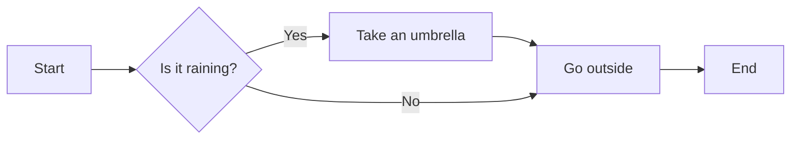
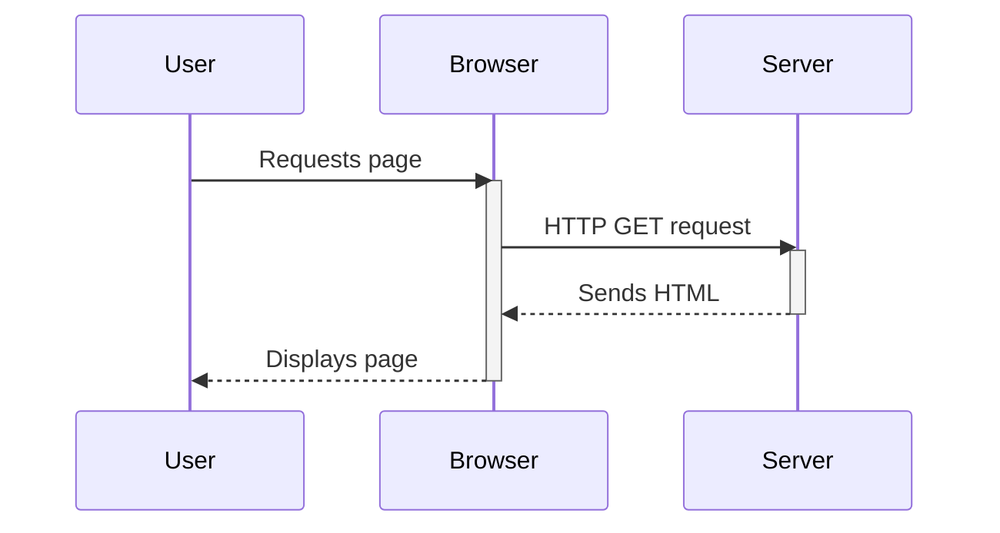
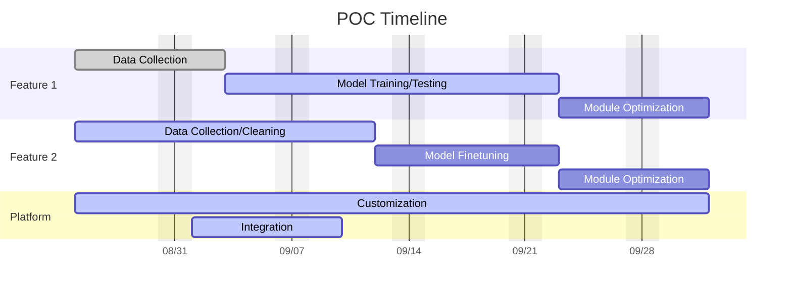

# Mermaid

## Syntax

### Basics

- Comment: `%%`
- Diagram Type:
  - Flowchart: `graph <DIRECTION>`
    - `TD` (Top to Down)
    - `LR` (Left to Right)
  - Sequence Diagram: `sequenceDiagram`
  - Gantt Chart: `gantt`
- Link and Arrows:
  - `-->`: Standard arrow
  - `<-->`: Bi-direction arrow
  - `-.->`: Dotted line
  - `==>`: Think line
  - `---`: Open link

### Node Shapes (table made by Gemini)

| Shape                   | Syntax                   | Appearance                               | Common Use Case                           |
| :---------------------- | :----------------------- | :--------------------------------------- | :---------------------------------------- |
| **Rectangle**           | `[Text]`                 | A standard box.                          | General process steps, tasks, or actions. |
| **Rounded Rectangle**   | `(Text)`                 | A box with rounded corners.              | Events or start/end points.               |
| **Circle**              | `((Text))`               | A perfect circle.                        | Start or end point of a process.          |
| **Rhombus (Diamond)**   | `{Text}`                 | A diamond or rhombus shape.              | **Decision points**.                      |
| **Asymmetric (Flag)**   | `>Text]`                 | A box with one side cut off at an angle. | Terminal or output points.                |
| **Hexagon**             | `{{Text}}`               | A six-sided polygon.                     | Initial or final points.                  |
| **Cylinder (Database)** | `[(Text)]`               | A cylindrical shape.                     | **Database** or data storage.             |
| **Subroutine**          | `[[Text]]`               | A rectangle with vertical lines.         | A predefined process or subroutine.       |
| **Trapeze**             | `[\Text\]` or `[/Text/]` | A trapezoid.                             | Manual operations or input/output.        |

## Exercises

### Flowchart

### Sequence Diagram

### Gantt Chart

