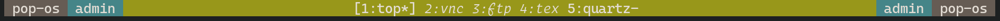
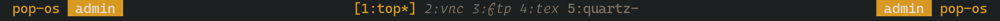
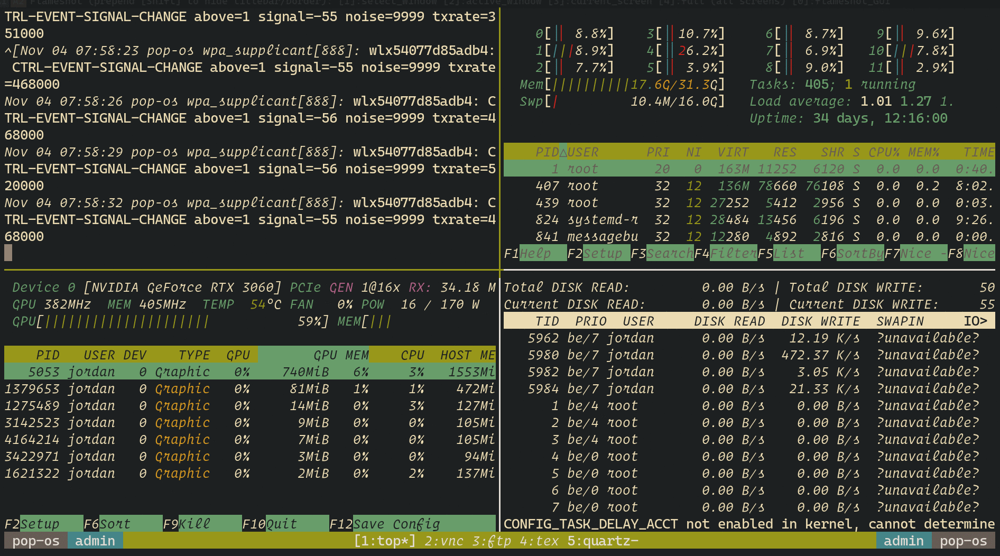

# TMUX Statusline Customization

## Configuration

- Configurations in this documentation are tested in `tmux 3.2a`
- [tmux-prefix-highlight](https://github.com/tmux-plugins/tmux-prefix-highlight) is recommended for better prefix press visualization

## DEMO (Statusline-ONLY)

- Description
  - Color code for modes:
    - Green: Normal, Red: Sync, Yellow: Copy
  - Session (#S): `admin`
  - Hostname (#H): `pop-os`
  - Window: `1:top*` (current), `2:vnc`, `3:ftp` , `4:tex`, `5:quartz-` (last)

### Style 1

- 
- 
- 

### Style 2

- 
- 
- 

### Style 3 (Current favorite, defaults for my `.tmux.conf`)

- 
- 
- 

### Style 4

- 
- 
- 

## DEMO (Full TMUX Window)

| Style 1 (`./confs/tmux.conf.1`)                         | Style 2 (`./confs/tmux.conf.2`)                         |
| ------------------------------------------------------- | ------------------------------------------------------- |
|  |  |

| Style 3 (`./confs/tmux.conf.3`)                         | Style 4 (`./confs/tmux.conf.4`)                         |
| ------------------------------------------------------- | ------------------------------------------------------- |
|  |  |
